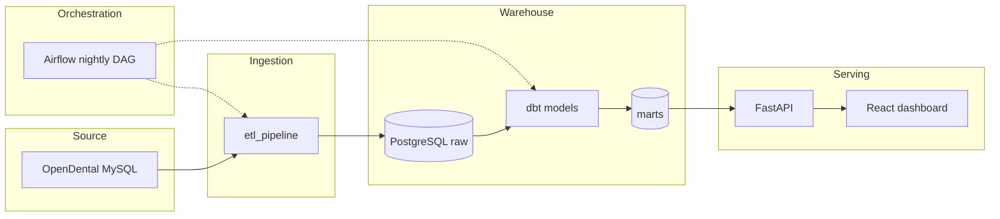

# Dental Practice Analytics Platform

Data pipeline and analytics for **OpenDental**: ETL from MySQL into PostgreSQL, dbt models, and a web API/dashboard for reporting. This repo shows how ingestion, transformation, and visualization are wired together—and why each piece exists.

---

## Why this project

**Problem:** Dental practices run on OpenDental (MySQL) but need analytics—revenue, AR, provider performance, patient retention—without touching production or dumping “just SQL” into a folder. They also need a way for staff to see the numbers, not run queries.

**What I built:** A full analytics stack: replicate 432+ OpenDental tables into PostgreSQL, transform them with dbt (staging → intermediate → marts), expose results via a FastAPI backend, and serve a React dashboard. So the pipeline is the source of truth, and the UI is the interface.

**Why these tools:**  
- **PostgreSQL** as the warehouse: one place for raw + transformed data, good for dbt and for the API.  
- **dbt** for transformations: versioned SQL, tests, docs, and a clear staging → intermediate → marts story.  
- **FastAPI** for the API: type-safe, OpenAPI docs, easy to secure (API key, rate limits, CORS).  
- **React + TypeScript** for the dashboard: so stakeholders get KPIs and charts without opening a database.

**What I ran into:** OpenDental’s schema is large and idiosyncratic (TINYINT booleans, sentinel dates, mixed naming). The ETL had to handle schema discovery, incremental loads per table, and batching by size. I separated demo (synthetic data, public) from clinic (PHI, local/IP-only) so the portfolio site never touches real patient data.

---

## Where things live

| Layer | Folder | What it does |
|-------|--------|--------------|
| **Ingestion** | [etl_pipeline/](etl_pipeline/) | Replicates OpenDental MySQL → PostgreSQL (`raw` schema). Schema discovery, incremental loading, config in `config/tables.yml`. |
| **Transformation** | [dbt_dental_models/](dbt_dental_models/) | dbt project: staging (88) → intermediate (50+) → marts (17). Builds the analytics warehouse. |
| **Orchestration** | [airflow/](airflow/) | Nightly DAGs: schema refresh → ETL → dbt → optional publish. Calls `mdc` for dbt and analytics publish. |
| **API** | [api/](api/) | FastAPI backend: patients, appointments, revenue, AR, providers, dashboard KPIs. Serves marts to the frontend. |
| **Visualization** | [frontend/](frontend/) | React dashboard: KPIs, revenue, AR aging, providers, patients, appointments. |
| **Dev CLI** | [tools/mdc_cli/](tools/mdc_cli/) | `mdc` — validate, run, deploy, and tunnel across API, ETL, dbt, and frontend. |

Each folder has its own README with setup and run instructions.

---

## Quick start

**Option A — Try the live demo (no setup)**  
- **Dashboard:** [https://dbtdentalclinic.com](https://dbtdentalclinic.com)  
- **API docs:** [https://api.dbtdentalclinic.com/docs](https://api.dbtdentalclinic.com/docs)  
Both use synthetic data only; no database or code required.

**Option B — Run locally (2–3 steps)**  

1. **One-time setup:** clone repo, install `mdc`, load optional aliases:
   ```powershell
   pip install -e tools/mdc_cli
   .\load_project.ps1
   mdc status
   ```
   `mdc status` shows config validation and **data freshness** (ETL load times, mart refresh, latest business dates). For clinic RDS: `mdc tunnel clinic-db` in another terminal, then `mdc status --env clinic --tunnel-db`.
2. **Backend:** from repo root:
   ```powershell
   mdc api run --env local
   ```
3. **Frontend:** in another terminal (from repo root):
   ```powershell
   mdc frontend dev
   ```
   Writes `frontend/.env.local` (API URL + key) and starts Vite. Open [http://localhost:3000](http://localhost:3000).

**Option C — Full local pipeline (synthetic data)**  
To run ETL + dbt + API + frontend on synthetic data, see [etl_pipeline/synthetic_data_generator/QUICKSTART.md](etl_pipeline/synthetic_data_generator/QUICKSTART.md). You’ll create a demo DB, generate data, run dbt, then start the API and frontend as above.

---

## Environment configuration

Configuration is **component-scoped** and loaded by **typed Python settings** (`api/settings.py`, ETL `settings_v2.py`, `mdc_cli/dbt_env.py`)—not a single root `.env` for API/ETL/dbt. The **`mdc` CLI** runs each component with an **isolated child-process env** for the `--env` stage you pass. There are no shell `*-init` scripts and no dot-sourcing `environment_manager.ps1` (legacy archived under `scripts/archive/`).

| Stage | Meaning | API | ETL | dbt |
|-------|---------|-----|-----|-----|
| `local` | Local dev (localhost) | ✅ | ✅ | ✅ |
| `demo` | Portfolio / synthetic (public) | ✅ | — | ✅ |
| `clinic` | Real clinic (PHI) | ✅ | ✅ | ✅ |
| `test` | Test DBs (CI) | ✅ | ✅ | — |

**Env files (by component):**

| Component | Files | Loaded when |
|-----------|-------|-------------|
| API | `api/.env_api_<stage>` | `mdc api … --env <stage>` (file skipped if OS env already set) |
| ETL | `etl_pipeline/.env_<stage>` | `mdc etl … --env <stage>` |
| dbt | `dbt_dental_models/.env_<stage>` or `deployment_credentials.json` | `mdc dbt … --env <stage>` |
| Frontend | `frontend/.env.local` (dev) | `mdc frontend dev` or Vite |
| Docker / Airflow | `/.env` (from `/.env.template`) | `docker-compose` only |

Root `/.env_local`, `/.env_clinic`, and `/.env_test` are **not used**—each component reads only from its own directory.

**Precedence:** process environment (shell, systemd on EC2) → component env file → safe defaults for optional vars.

**Validate before you run:**

```powershell
mdc status
mdc api test-config --env local
mdc etl validate --env local --profile load
mdc dbt validate --env local
```

**Reference:** [docs/ENVIRONMENT_FILES.md](docs/ENVIRONMENT_FILES.md) (full inventory and loaders), [tools/mdc_cli/README.md](tools/mdc_cli/README.md) (commands and aliases). Run `.\scripts\utils\list_env_files.ps1` to see which env files exist on disk.

---

## mdc CLI

The **`mdc` CLI** is the default developer interface for this monorepo. It replaced shell `*-init` scripts and the archived `environment_manager.ps1` with **stateless, isolated child-process runs**.

**How it works:**

1. You pick a component and stage (`mdc api run --env clinic`).
2. mdc loads config through the component’s Pydantic settings (`api/settings.py`, ETL `settings_v2.py`, or `mdc_cli/dbt_env.py`).
3. Stage-scoped vars from your parent shell are scrubbed so nothing leaks in.
4. mdc builds a minimal child env from the validated settings and runs the tool in that component’s venv.

Your shell stays clean — no dot-sourcing, no exports to remember.

**Install once:**

```powershell
pip install -e tools/mdc_cli
.\load_project.ps1    # optional aliases: status, api-run, etl-run, dbt, …
```

**Common commands:**

| Task | Command |
|------|---------|
| Check config | `mdc status` |
| Run API locally | `mdc api run --env local` |
| Run API against clinic RDS (via tunnel) | `mdc tunnel clinic-db` then `mdc api run --env clinic --tunnel-db` |
| Validate / run ETL | `mdc etl validate --env local --profile load` · `mdc etl run --env clinic --profile full` |
| Run dbt | `mdc dbt run --env local` · `mdc dbt invoke --env local -- deps` |
| Frontend dev server | `mdc frontend dev` |
| Publish local marts → clinic RDS | `mdc publish analytics --env clinic` |
| Deploy frontend / API | `mdc deploy frontend --target demo` · `mdc deploy api --env clinic` |

Full command list, PowerShell alias defaults, and CI notes: [tools/mdc_cli/README.md](tools/mdc_cli/README.md).

---

## How the pieces connect



Same flow in one line:  
**OpenDental (MySQL) → ETL → PostgreSQL raw → dbt (staging → intermediate → marts) → API → Dashboard.**

**Nightly orchestration:** [airflow/dags/etl_pipeline_dag.py](airflow/dags/etl_pipeline_dag.py) runs schema refresh, ETL, dbt (via `mdc dbt invoke`), and optional `mdc publish analytics`. See [airflow/README.md](airflow/README.md) and [airflow/NIGHTLY_RUN.md](airflow/NIGHTLY_RUN.md).

---

## Architecture

### ETL
- Schema discovery over 432+ tables; incremental loading using timestamp columns
- Batched processing (1K–5K rows by table size); validation and monitoring
- CLI: `mdc etl run|status|validate --env <stage>`

### dbt (Analytics)

| Layer | Count | Role |
|-------|-------|------|
| Staging | 88 | Standardized source data, metadata columns, validation |
| Intermediate | 50+ | Fees, insurance, payments, AR, collections, scheduling, patient journey |
| Marts | 17 | Dimensions (patient, provider, …), facts (appointment, claim, …), KPI summaries |

CLI: `mdc dbt run|test|docs --env <stage>`

## Stack

- **Source**: MariaDB/MySQL (OpenDental)
- **Warehouse**: PostgreSQL
- **ETL**: Python, CLI in `etl_pipeline/cli/` (via `mdc etl …`)
- **Transform**: dbt Core (via `mdc dbt …`)
- **Orchestration**: Apache Airflow (native install; nightly ETL + dbt DAG)
- **Dev tooling**: `mdc` CLI (`tools/mdc_cli/`) — env isolation, validate, run, deploy, SSM tunnels
- **API**: FastAPI (OpenAPI, API key auth, rate limiting, CORS)
- **Frontend**: React, TypeScript, Material-UI, Recharts

## API

### FastAPI backend

- **Endpoints**: Patients, appointments, reports (revenue, providers, dashboard KPIs, AR)
- **Auth**: API key in `X-API-Key` header; **rate limits**: 60/min, 1000/hour by IP
- **Security**: CORS, request logging, Pydantic validation, parameterized queries. See [api/README.md](api/README.md) for details.
- **Docs**: OpenAPI at `/docs`

Optional hosted API (sample data): [https://api.dbtdentalclinic.com](https://api.dbtdentalclinic.com) (EC2 + ALB, HTTPS via ACM).

### Frontend (React + TypeScript)

- **Pages**: Dashboard (KPIs), Revenue, AR aging, Providers, Patients, Appointments, treatment acceptance
- **Stack**: React, Material-UI, Zustand, Recharts, Axios; React Router
- **Security**: Error sanitization, PII handling, search engines blocked via robots.txt

Optional hosted frontend (sample data): [https://dbtdentalclinic.com](https://dbtdentalclinic.com) (S3 + CloudFront).

### Project layout
```
dbt_dental_clinic/
├── etl_pipeline/              # Ingestion: MySQL → PostgreSQL
│   ├── etl_pipeline/          # Package (cli/, core/, config/, loaders/)
│   ├── config/                # tables.yml, env templates
│   ├── synthetic_data_generator/   # Synthetic OpenDental-like data (see QUICKSTART.md)
│   └── scripts/               # Schema analysis, DB setup, helpers
├── dbt_dental_models/         # Transformation: staging → intermediate → marts
├── airflow/                   # Nightly DAGs (ETL, schema analysis, dbt, publish)
│   └── dags/                  # etl_pipeline_dag.py, schema_analysis_dag.py
├── api/                       # FastAPI (routers, models, services)
├── frontend/                  # React app (src/pages, components, services)
├── tools/
│   └── mdc_cli/               # mdc CLI — validate, run, deploy, tunnel (pip install -e)
├── scripts/
│   ├── mdc_aliases.ps1        # optional PowerShell aliases (load_project.ps1)
│   ├── archive/               # legacy environment_manager (Phase 5.5 reference)
│   ├── deployment/            # Deploy to EC2, deploy dbt/api files, credentials
│   ├── ec2/                   # Run dbt on EC2, setup, fixes
│   ├── verification/          # Verify AWS resources
│   ├── database/              # Local demo DB setup, query
│   ├── testing/               # API/connection tests
│   └── utils/                 # One-off tools, exports, metadata, audits
├── consult_audio_pipe/        # Consult recording pipeline (mdc consult-audio …)
├── docs/                      # Deployment, env files, architecture
└── load_project.ps1           # Load mdc PowerShell aliases from repo root
```

**Component READMEs:**  
- [tools/mdc_cli/README.md](tools/mdc_cli/README.md) — `mdc` CLI: validate, run, deploy, tunnels  
- [airflow/README.md](airflow/README.md) — DAG overview, native setup, nightly run  
- [etl_pipeline/README.md](etl_pipeline/README.md) — ETL architecture and run instructions  
- [dbt_dental_models/README.md](dbt_dental_models/README.md) — dbt layers and development  
- [api/README.md](api/README.md) — API env, security, deployment  
- [frontend/README.md](frontend/README.md) — Frontend setup and env vars  
- [docs/ENVIRONMENT_FILES.md](docs/ENVIRONMENT_FILES.md) — env file inventory and loading rules  

## Synthetic data

The `etl_pipeline/synthetic_data_generator/` creates synthetic OpenDental-like data (Faker-based, no real PHI) for development and testing. Configurable patient count; maintains referential integrity and basic dental workflow (appointments, procedures, claims, payments). See [etl_pipeline/synthetic_data_generator/QUICKSTART.md](etl_pipeline/synthetic_data_generator/QUICKSTART.md).

## Deployment (optional)

Deployment is optional; the app can run locally against a PostgreSQL warehouse.

**Frontend (S3 + CloudFront):** `mdc deploy frontend --target demo|clinic` or alias `demo-frontend-deploy`. `mdc frontend dev` for local Vite. `mdc deploy dbt-docs` for portfolio dbt docs site.

**Backend (EC2 + ALB):** API can be run on EC2 behind an ALB with RDS PostgreSQL; see `docs/DEPLOYMENT_WORKFLOW.md` and deployment scripts in [`scripts/deployment/`](scripts/deployment/) (see [`scripts/README.md`](scripts/README.md)). Hosted sample API: [https://api.dbtdentalclinic.com](https://api.dbtdentalclinic.com); frontend: [https://dbtdentalclinic.com](https://dbtdentalclinic.com). Demo uses synthetic data only; no production OpenDental connection.

**Environment:** Use `mdc … --env <stage>` for API, ETL, and dbt; see [Environment configuration](#environment-configuration) and [docs/ENVIRONMENT_FILES.md](docs/ENVIRONMENT_FILES.md). On EC2, `mdc deploy api --env clinic` copies `api/.env_api_clinic` to the instance as `api/.env` for systemd.

