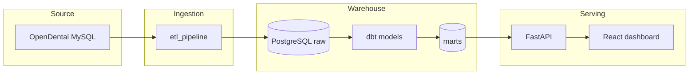

# Dental Practice Analytics Platform

Data pipeline and analytics for **OpenDental**: ETL from MySQL into PostgreSQL, dbt models, and a web API/dashboard for reporting. This repo shows how ingestion, transformation, and visualization are wired together—and why each piece exists.

---

## Why this project

**Problem:** Dental practices run on OpenDental (MySQL) but need analytics—revenue, AR, provider performance, patient retention—without touching production or dumping “just SQL” into a folder. They also need a way for staff to see the numbers, not run queries.

**What I built:** A full analytics stack: replicate 432+ OpenDental tables into PostgreSQL, transform them with dbt (staging → intermediate → marts), expose results via a FastAPI backend, and serve a React dashboard. So the pipeline is the source of truth, and the UI is the interface.

**Why these tools:**  
- **PostgreSQL** as the warehouse: one place for raw + transformed data, good for dbt and for the API.  
- **dbt** for transformations: versioned SQL, tests, docs, and a clear staging → intermediate → marts story.  
- **FastAPI** for the API: type-safe, OpenAPI docs, easy to secure (API key, rate limits, CORS).  
- **React + TypeScript** for the dashboard: so stakeholders get KPIs and charts without opening a database.

**What I ran into:** OpenDental’s schema is large and idiosyncratic (TINYINT booleans, sentinel dates, mixed naming). The ETL had to handle schema discovery, incremental loads per table, and batching by size. I separated demo (synthetic data, public) from clinic (PHI, local/IP-only) so the portfolio site never touches real patient data.

---

## Where things live

| Layer            | Folder | What it does |
|-----------------|--------|--------------|
| **Ingestion**   | [etl_pipeline/](etl_pipeline/) | Replicates OpenDental MySQL → PostgreSQL (`raw` schema). Schema discovery, incremental loading, config in `config/tables.yml`. |
| **Transformation** | [dbt_dental_models/](dbt_dental_models/) | dbt project: staging (88) → intermediate (50+) → marts (17). Builds the analytics warehouse. |
| **API**         | [api/](api/) | FastAPI backend: patients, appointments, revenue, AR, providers, dashboard KPIs. Serves marts to the frontend. |
| **Visualization** | [frontend/](frontend/) | React dashboard: KPIs, revenue, AR aging, providers, patients, appointments. |

Each folder has its own README with setup and run instructions.

---

## Quick start

**Option A — Try the live demo (no setup)**  
- **Dashboard:** [https://dbtdentalclinic.com](https://dbtdentalclinic.com)  
- **API docs:** [https://api.dbtdentalclinic.com/docs](https://api.dbtdentalclinic.com/docs)  
Both use synthetic data only; no database or code required.

**Option B — Run locally (2–3 steps)**  

1. **One-time setup:** clone repo, then use the environment manager so API + ETL + dbt point at your DBs:
   ```powershell
   .\scripts\environment_manager.ps1
   # Choose api-init (then local/demo), or etl-init, or dbt-init as needed
   ```
2. **Backend:** from repo root, start the API (after `api-init`):
   ```powershell
   cd api && uvicorn main:app --reload
   ```
3. **Frontend:** in another terminal:
   ```powershell
   cd frontend && npm install && npm run dev
   ```
   Open [http://localhost:3000](http://localhost:3000); set `VITE_API_URL=http://localhost:8000` and your API key in `frontend/.env` or `.env.local`.

**Option C — Full local pipeline (synthetic data)**  
To run ETL + dbt + API + frontend on synthetic data, see [etl_pipeline/synthetic_data_generator/QUICKSTART.md](etl_pipeline/synthetic_data_generator/QUICKSTART.md). You’ll create a demo DB, generate data, run dbt, then start the API and frontend as above.

---

## How the pieces connect



Same flow in one line:  
**OpenDental (MySQL) → ETL → PostgreSQL raw → dbt (staging → intermediate → marts) → API → Dashboard.**

---

## Overview

- **ETL**: Replicates 432+ OpenDental tables to PostgreSQL with schema discovery and incremental loading
- **Analytics**: dbt project with 88 staging, 50+ intermediate, and 17 mart models
- **API**: FastAPI backend serving analytics and patient/appointment endpoints
- **Frontend**: React dashboard for revenue, AR, providers, and patients

## Architecture

### Data Flow
```
OpenDental (MySQL) → ETL → PostgreSQL → dbt → API / Dashboard
    432 tables        replication   warehouse   models
```

### ETL
- Schema discovery over 432 tables
- Incremental loading using timestamp columns
- Batched processing (1K–5K rows by table size)
- Validation and basic monitoring

### dbt (Analytics)

#### Staging (88 models)
- Standardized source data, metadata columns (`_loaded_at`, `_transformed_at`, `_created_by`), validation

#### Intermediate (50+ models)
- Cross-system: patient financial/treatment journey; system-specific: fees, insurance, payments, AR, collections, communications, scheduling

#### Marts (17 models)
- Dimensions: Patient, Provider, Procedure, Insurance, Date
- Facts: Appointment, Claim, Payment, Communication
- Summaries: production, AR, revenue lost, provider performance, patient retention

## Stack

- **Source**: MariaDB/MySQL (OpenDental)
- **Warehouse**: PostgreSQL
- **ETL**: Python, CLI in `etl_pipeline/cli/`
- **Transform**: dbt Core
- **API**: FastAPI (OpenAPI, API key auth, rate limiting, CORS)
- **Frontend**: React, TypeScript, Material-UI, Recharts

## API

### FastAPI backend

- **Endpoints**: Patients, appointments, reports (revenue, providers, dashboard KPIs, AR)
- **Auth**: API key in `X-API-Key` header; **rate limits**: 60/min, 1000/hour by IP
- **Security**: CORS, request logging, Pydantic validation, parameterized queries. See [api/README.md](api/README.md) for details.
- **Docs**: OpenAPI at `/docs`

Optional hosted API (sample data): [https://api.dbtdentalclinic.com](https://api.dbtdentalclinic.com) (EC2 + ALB, HTTPS via ACM).

### Frontend (React + TypeScript)

- **Pages**: Dashboard (KPIs), Revenue, AR aging, Providers, Patients, Appointments, treatment acceptance
- **Stack**: React, Material-UI, Zustand, Recharts, Axios; React Router
- **Security**: Error sanitization, PII handling, search engines blocked via robots.txt

Optional hosted frontend (sample data): [https://dbtdentalclinic.com](https://dbtdentalclinic.com) (S3 + CloudFront).

### Project layout
```
dbt_dental_clinic/
├── etl_pipeline/              # Ingestion: MySQL → PostgreSQL
│   ├── etl_pipeline/           # Package (cli/, core/, config/, loaders/)
│   ├── config/                # tables.yml, env templates
│   ├── synthetic_data_generator/   # Synthetic OpenDental-like data (see QUICKSTART.md)
│   └── scripts/               # Schema analysis, DB setup, helpers
├── dbt_dental_models/         # Transformation: staging → intermediate → marts
├── api/                       # FastAPI (routers, models, services)
├── frontend/                  # React app (src/pages, components, services)
├── scripts/
│   ├── environment_manager.ps1   # dbt-init, etl-init, api-init, frontend-deploy, env-status
│   ├── deployment/               # Deploy to EC2, deploy dbt/api files, credentials
│   ├── ec2/                      # Run dbt on EC2, setup, fixes
│   ├── verification/             # Verify AWS resources
│   ├── database/                 # Local demo DB setup, query
│   ├── testing/                  # API/connection tests
│   └── utils/                    # list_env_files, generate_api_key, backup, etc.
├── docs/                      # Deployment, env files, architecture
└── (airflow, consult_audio_pipe, etc. — see repo root)
```

**Component READMEs:**  
- [etl_pipeline/README.md](etl_pipeline/README.md) — ETL architecture and run instructions  
- [dbt_dental_models/README.md](dbt_dental_models/README.md) — dbt layers and development  
- [api/README.md](api/README.md) — API env, security, deployment  
- [frontend/README.md](frontend/README.md) — Frontend setup and env vars  

## Synthetic data

The `etl_pipeline/synthetic_data_generator/` creates synthetic OpenDental-like data (Faker-based, no real PHI) for development and testing. Configurable patient count; maintains referential integrity and basic dental workflow (appointments, procedures, claims, payments). See [etl_pipeline/synthetic_data_generator/QUICKSTART.md](etl_pipeline/synthetic_data_generator/QUICKSTART.md).

## Deployment (optional)

Deployment is optional; the app can run locally against a PostgreSQL warehouse.

**Frontend (S3 + CloudFront):** Use the `frontend-deploy` command from `scripts/environment_manager.ps1`. It builds the React app, uploads to S3, and invalidates CloudFront. Set `FRONTEND_BUCKET_NAME`, `FRONTEND_DIST_ID`, and `FRONTEND_DOMAIN` (env or `.frontend-deploy.json`). Other commands: `dbt-init`, `etl-init`, `api-init`, `frontend-status`, `env-status`.

**Backend (EC2 + ALB):** API can be run on EC2 behind an ALB with RDS PostgreSQL; see `docs/DEPLOYMENT_WORKFLOW.md` and deployment scripts in [`scripts/deployment/`](scripts/deployment/) (see [`scripts/README.md`](scripts/README.md)). Hosted sample API: [https://api.dbtdentalclinic.com](https://api.dbtdentalclinic.com); frontend: [https://dbtdentalclinic.com](https://dbtdentalclinic.com). Demo uses synthetic data only; no production OpenDental connection.

**Environment files:** The repo uses many `.env` and `.env_*` files (API, ETL, dbt, frontend, Docker). For a single reference and inventory script, see [docs/ENVIRONMENT_FILES.md](docs/ENVIRONMENT_FILES.md). Run `.\scripts\utils\list_env_files.ps1` to see which env files exist.

