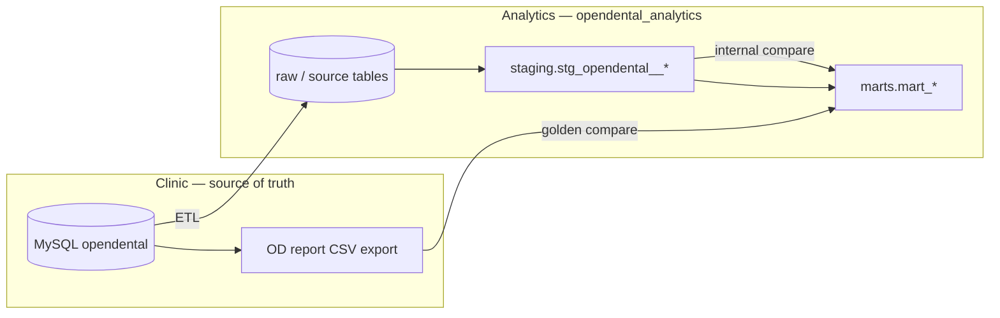

# KPI Validation (OpenDental Report Benchmarking)


**Purpose:** Prove that our mart models implement the **same business logic** OpenDental uses in its
standard reports — same definitions, filters, inclusions/exclusions, sign conventions, and grain.


Golden exports and compare SQL are how we **test** that logic. Matching totals within tolerance is
evidence the logic is correct, not the goal itself. When numbers diverge, the first question is
*which rule differs* (document in `FIELD_MAP.md` and `known_deltas`), not how to widen tolerance.


**Clinic context:** Golden exports retain **full PHI** on the secure clinic site.


**Full OD report list:** [OPENDENTAL_REPORTS_INDEX.md](./OPENDENTAL_REPORTS_INDEX.md)


**Completed example:** [daily-payments/](./daily-payments/) — first KPI through full workflow (OD → mart → API). See [VALIDATION_REPORT.md](./daily-payments/VALIDATION_REPORT.md).


---


## How validation works


OpenDental’s report generator and our analytics warehouse read the **same clinic database**
(MySQL `opendental`: `payment`, `claimpayment`, etc.). KPI validation checks that our **dbt mart**
applies the **same business rules** as the OD report when turning that data into a KPI.





### Four layers we compare

| Step | Compare | What it proves |
| --- | --- | --- |
| **0. Source → raw** | MySQL vs `raw.*` reconciliation (row counts, or complete-production totals by day) | **Replica fidelity** — catches [replica row drift](../../../docs/etl/findings/ETL-FND-001-replica-row-drift-procedurelog.md) before blaming staging or mart. Required for tables with in-place updates (`procedurelog` ProcStatus, etc.). |

**Automated Layer 0 (Tier A):**

```powershell
mdc etl invoke --env local -- check-replica-drift --tier A --warn-only
mdc etl invoke --env local -- check-replica-drift --check L0-PAY-001 --warn-only
mdc etl invoke --env local -- check-procedurelog-drift --warn-only   # L0-PROC-001 alias
```

Registry: `etl_pipeline/config/replica_drift_checks.yml` — checks `L0-PROC-001` … `L0-ADJ-001`.
| **1. OD → staging** | Golden CSV section totals vs `staging` reconstruction SQL | Warehouse has the same underlying rows OD used. Catches **ETL lag** (late inserts) before blaming the mart. |
| **2. Staging → mart** | `compare_*_staging.sql` | dbt mart is a faithful aggregation of staging — no dropped insurance, wrong PayType filter, etc. |
| **3. Mart → OD** | `compare_*_collections.sql` + `FIELD_MAP.md` | **End-to-end:** `opendental_analytics.marts.mart_*` matches what the OD report shows the practice. This is the KPI sign-off. |
| **4. API / frontend** | `compare/compare_daily_collections_api.sql` + optional `api/tests/kpi/verify_daily_collections.py` | Clinic app reads mart via API with **no extra logic**. SQL must match mart; UI must show the same numbers. |

**Platform findings** (pipeline defects affecting multiple KPIs): [docs/etl/findings/](../../../docs/etl/findings/README.md)


The OD CSV **Amount** column (summed to section subtotals) is the report’s definition of the KPI.
That report is built from the same tables we replicate. Staging should reconstruct OD totals when
ETL is caught up; the mart should match staging when dbt logic is correct. All three should
agree on golden dates.


### Spot-check dates (sampling strategy)


We do **not** need every calendar day. Pick a small set of **random spot-check dates** that vary
the scenario, export OD once per date, and record findings:


| Goal | Example (Daily Payments) |
| --- | --- |
| Weekday + insurance + multiple PayTypes | 2025-10-07 |
| Weekday + mixed patient/insurance after mart fix | 2026-06-24 |
| Weekend + patient-only (no claim checks) | 2025-11-08 |


Document each date in `{report}/findings/{date}.md`. When spot-checks pass, status →
`within_tolerance` in [KPI_VALIDATION_REGISTRY.md](./KPI_VALIDATION_REGISTRY.md).


---


## What we validate


For each KPI / report pair (registry row):


1. **Business rules** — What counts toward the measure? What is excluded? How are refunds,
   transfers, and splits handled? Document in `{report}/FIELD_MAP.md` and mart YAML.

2. **Report parameters** — Date window, providers, clinics, and OD filter settings used for the
   golden export (golden manifest + screenshots).

3. **Grain** — OD detail row vs our row (e.g. provider splits vs payment headers). Mismatch here
   often looks like a total error but is a logic gap.

4. **Totals and row-level detail** — Section subtotals and net collections should reconcile when
   rules (1–3) align. Use tolerance only for rounding, timing, or documented deltas.


**Accepted differences** belong in the registry `known_deltas` column (e.g. ETL lag, intentional
simplification). Unexplained FAILs mean fix the model or document why OD behaves differently.


---


## Directory layout


Each **OpenDental report name** (kebab-case) is a folder under `validation/kpi/`:


```

validation/kpi/

├── README.md

├── KPI_VALIDATION_REGISTRY.md

├── OPENDENTAL_REPORTS_INDEX.md

├── daily-payments/              # OD: Daily Payments (example — validated)

├── production-and-income/       # OD: Production and Income

├── aging-of-a-r/                # OD: Aging of A/R (Monthly)

└── ...                          # 51 report folders — see index

```


Every report folder has the same children:


```

{report}/

├── README.md

├── VALIDATION_REPORT.md         # formal sign-off (when complete)

├── FIELD_MAP.md                 # OD report ↔ mart business rules

├── findings/

├── compare/

├── golden/

├── screenshots/

└── scripts/                     # e.g. golden CSV → PHI-free snapshot (see scripts/README.md)

```


Folder name = OD report name in kebab-case (exactly what we validate against).


**Golden CSV naming (Payments):** `od_daily_payments_{mm}{dd}{yyyy}_{mm}{dd}{yyyy}.csv`  

Single-day example: `od_daily_payments_10072025_10072025.csv`  

**Snapshot YAML:** same stem + `.snapshot.yml` → `od_daily_payments_10072025_10072025.snapshot.yml`


Private directories (`findings/`, `golden/`, `screenshots/`) are gitignored — see `.gitignore`.


Scaffold all report folders: `scripts/scaffold_od_report_folders.ps1`


---


## Workflow (step by step)


### Setup (once per KPI)


1. Add a row to [KPI_VALIDATION_REGISTRY.md](./KPI_VALIDATION_REGISTRY.md) (folder = OD report name in kebab-case).

2. Create or use `validation/kpi/{report}/` with `FIELD_MAP.md`, `compare/`, `golden/`, `findings/`.

3. Document OD ↔ mart **business rules** in `FIELD_MAP.md` (date columns, inclusions, grain).


### Per spot-check date


4. **Pick a date** — random day that exercises a distinct scenario (weekday/weekend, insurance yes/no, etc.).

5. **Export OD golden** on the clinic machine: Reports → Standard → … → CSV. Save to `{report}/golden/` with documented filters (providers, Include Unearned, date range). Same filters every golden date for that KPI.

6. **Parse section totals** — run the golden parser on the clinic machine (recommended). It
   strips PHI and writes section subtotals to `golden/snapshots/*.snapshot.yml` for compare SQL.
   See [daily-payments/scripts/README.md](./daily-payments/scripts/README.md).

   ```bash
   cd validation/kpi/daily-payments
   python scripts/parse_od_daily_payments_golden.py golden/od_daily_payments_MMDDYYYY_MMDDYYYY.csv
   ```

7. **Run compare SQL in DBeaver** against PostgreSQL `opendental_analytics` (`analytics_user`):

   | Order | SQL | Database objects |
   | --- | --- | --- |
   | a | `compare/compare_daily_collections_staging.sql` | `staging.stg_opendental__*` → `marts.mart_*` |
   | b | `compare/investigate_*_{date}.sql` | Drill-down by PayType / section |
   | c | `compare/compare_daily_collections.sql` | `marts.mart_*` vs OD total from golden |
   | d | `compare/compare_daily_collections_api.sql` | API-equivalent SELECT vs mart vs OD (frontend path) |

   If (a) fails → mart or staging logic. If (a) passes but (c) fails → ETL lag or OD filter mismatch vs golden export. If (d) fails → API wiring or wrong database. After (d) PASS, run `python api/tests/kpi/verify_daily_collections.py` (all three golden dates).

8. **Record** results in `findings/{date}.md` (OD total, mart total, diff, PASS/FAIL).

9. Repeat steps 4–8 for **2–3 spot-check dates** with different scenarios.


### Sign-off


10. When all spot-checks are `within_tolerance`, write `{report}/VALIDATION_REPORT.md` and set registry status.

11. Add entry to `frontend/src/config/validatedKpis.ts` if the KPI is exposed in the clinic app.


**Where to run queries**

| System | Connection | Use for |
| --- | --- | --- |
| OpenDental (source) | MySQL `opendental` | Ad hoc source checks only; golden CSV is the report benchmark |
| Analytics warehouse | PostgreSQL `opendental_analytics` — schemas `staging`, `marts` | All compare SQL |


---


## Tolerance


**Canonical per-KPI values:** [`KPI_VALIDATION_REGISTRY.md`](./KPI_VALIDATION_REGISTRY.md) — `tolerance` column on each registry row (e.g. Daily net collections: **±$10 or ±0.5%**, whichever passes first).


**Result semantics** (same for all KPIs unless a row notes an exception):


| Result | Condition |

| --- | --- |

| **PASS** | `abs(mart − od) ≤ amount_abs` **or** `abs(mart − od) / abs(od) < pct` |

| **WARN** | Not PASS, but within **2×** tolerance (percent threshold only) |

| **FAIL** | Outside 2× tolerance |


When OD total is zero and mart is zero, treat as PASS. When OD golden is not yet exported, status is **PENDING** (not FAIL).


**Per-snapshot config:** copy `{report}/golden_manifest.example.yml` → `golden_manifest.yml` and set `tolerance.amount_abs` / `tolerance.pct` to match the registry row for that KPI.


**Enforcement:** compare SQL under `{report}/compare/` implements the rule (e.g. [`daily-payments/compare/compare_daily_collections.sql`](./daily-payments/compare/compare_daily_collections.sql)). Keep SQL thresholds in sync with the registry and golden manifest.


---


## Report folders (active validation)


| Folder (OD report) | Mart (`opendental_analytics.marts`) | Status | Report |

| --- | --- | --- | --- |

| [daily-payments](./daily-payments/) | `mart_daily_payments` | **`within_tolerance` — complete** | [VALIDATION_REPORT.md](./daily-payments/VALIDATION_REPORT.md) |
| [daily-production-by-procedure](./daily-production-by-procedure/) | `fact_procedure` (agg.) | `compare_sql_draft` (1/3 PASS) | [README.md](./daily-production-by-procedure/README.md) · [2026-06-10 PASS](./daily-production-by-procedure/findings/2026-06-10.md) |
| [aging-of-a-r](./aging-of-a-r/) | `mart_ar_summary` | Not started | — |


---


## Related documentation


- `validation/README.md` — internal layer validation

- [VALIDATION_REPORT.md](./daily-payments/VALIDATION_REPORT.md) — formal daily net collections report (OD Daily Payments)

