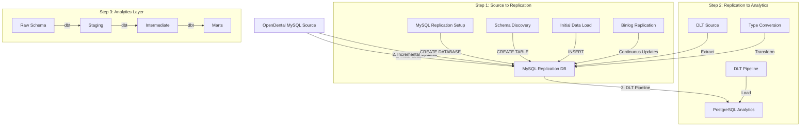

# DLT Pipeline Development Plan

## Data Flow Architecture



## 1. MySQL Replication Layer

### 1.1 Replication Setup
The replication layer is responsible for maintaining a local copy of the OpenDental database. This is implemented in `replication_source.py`:

```python
# replication_source.py
import mysql.connector
from mysql.connector import Error

def setup_replication():
    """
    1. Create replication database if not exists
    2. Set up MySQL replication user
    3. Configure binlog replication
    4. Create initial schema
    """
    try:
        # Create replication database
        connection = mysql.connector.connect(
            host=config['replication_host'],
            user=config['replication_user'],
            password=config['replication_password']
        )
        
        cursor = connection.cursor()
        cursor.execute(f"CREATE DATABASE IF NOT EXISTS {config['replication_db']}")
        
        # Set up replication user
        cursor.execute(f"""
            CREATE USER IF NOT EXISTS '{config['replication_user']}'@'%'
            IDENTIFIED BY '{config['replication_password']}'
        """)
        
        # Grant replication privileges
        cursor.execute(f"""
            GRANT REPLICATION SLAVE, REPLICATION CLIENT
            ON *.* TO '{config['replication_user']}'@'%'
        """)
        
        # Configure binlog replication
        # ... (binlog configuration)
        
    except Error as e:
        logger.error(f"Error setting up replication: {e}")
        raise
    finally:
        if connection.is_connected():
            cursor.close()
            connection.close()

def sync_schema():
    """
    1. Get source schema
    2. Compare with replication schema
    3. Create/alter tables as needed
    """
    try:
        # Get source schema
        source_connection = mysql.connector.connect(
            host=config['source_host'],
            user=config['source_user'],
            password=config['source_password'],
            database=config['source_db']
        )
        
        # Get replication schema
        replication_connection = mysql.connector.connect(
            host=config['replication_host'],
            user=config['replication_user'],
            password=config['replication_password'],
            database=config['replication_db']
        )
        
        # Compare and sync schemas
        # ... (schema comparison and sync logic)
        
    except Error as e:
        logger.error(f"Error syncing schema: {e}")
        raise
    finally:
        if source_connection.is_connected():
            source_connection.close()
        if replication_connection.is_connected():
            replication_connection.close()
```

### 1.2 Testing Replication
```sql
-- Test replication setup
SHOW SLAVE STATUS\G

-- Verify data sync
SELECT COUNT(*) FROM source_table;
SELECT COUNT(*) FROM replication_table;

-- Check schema match
SHOW CREATE TABLE source_table;
SHOW CREATE TABLE replication_table;
```

## 2. Schema Management

### 2.1 Schema Discovery and DDL Generation
```python
# schema_manager.py
def generate_postgres_ddl(mysql_schema):
    """
    1. Convert MySQL types to PostgreSQL
    2. Handle special cases
    3. Generate DDL
    """
    type_mappings = {
        'TINYINT': 'SMALLINT',
        'INT': 'INTEGER',
        'BIGINT': 'BIGINT',
        'VARCHAR': 'VARCHAR',
        'TEXT': 'TEXT',
        'DATETIME': 'TIMESTAMP',
        'ENUM': 'VARCHAR',  # Special handling needed
        'SET': 'VARCHAR',   # Special handling needed
    }
    
    # Generate PostgreSQL DDL
    # ... (DDL generation logic)

def setup_tracking_tables():
    """
    1. Create DLT tracking tables
    2. Set up versioning
    3. Configure metrics
    """
    tracking_tables = [
        """
        CREATE TABLE IF NOT EXISTS _dlt_loads (
            load_id SERIAL PRIMARY KEY,
            table_name VARCHAR(255),
            load_start TIMESTAMP,
            load_end TIMESTAMP,
            rows_loaded INTEGER,
            status VARCHAR(50)
        )
        """,
        """
        CREATE TABLE IF NOT EXISTS _dlt_version (
            version_id SERIAL PRIMARY KEY,
            table_name VARCHAR(255),
            version INTEGER,
            applied_at TIMESTAMP
        )
        """,
        # ... (other tracking tables)
    ]
    
    # Create tracking tables
    # ... (table creation logic)
```

### 2.2 Schema Validation
```sql
-- Verify PostgreSQL schema
SELECT table_name, column_name, data_type 
FROM information_schema.columns 
WHERE table_schema = 'raw';

-- Check tracking tables
SELECT * FROM _dlt_loads;
SELECT * FROM _dlt_version;
```

## 3. DLT Pipeline

### 3.1 Pipeline Setup
```python
# pipeline.py
def setup_pipeline():
    """
    1. Configure source
    2. Set up transformations
    3. Configure destination
    4. Set up tracking
    """
    # Configure DLT pipeline
    pipeline = dlt.pipeline(
        pipeline_name='opendental_dlt',
        destination='postgres',
        dataset_name='raw'
    )
    
    # Set up source
    source = opendental_source()
    
    # Configure transformations
    # ... (transformation setup)
    
    return pipeline, source

def run_pipeline():
    """
    1. Extract from replication
    2. Transform data
    3. Load to analytics
    4. Update tracking
    """
    pipeline, source = setup_pipeline()
    
    # Run pipeline
    load_info = pipeline.run(source)
    
    # Update tracking
    update_tracking_tables(load_info)
```

### 3.2 Type Conversion
```python
def convert_types():
    """
    1. Map MySQL types to PostgreSQL types
    2. Handle NULL values
    3. Convert character sets
    4. Handle date/time formats
    """
    type_conversions = {
        'datetime': lambda x: x.strftime('%Y-%m-%d %H:%M:%S') if x else None,
        'date': lambda x: x.strftime('%Y-%m-%d') if x else None,
        'time': lambda x: x.strftime('%H:%M:%S') if x else None,
        'enum': lambda x: str(x) if x else None,
        'set': lambda x: str(x) if x else None,
    }
    
    # Apply type conversions
    # ... (conversion logic)
```

### 3.3 Data Flow Testing
```sql
-- Verify data in analytics
SELECT COUNT(*) FROM raw.table_name;

-- Check type conversions
SELECT column_name, data_type 
FROM information_schema.columns 
WHERE table_schema = 'raw' 
AND table_name = 'table_name';

-- Verify tracking
SELECT * FROM _dlt_metrics 
WHERE table_name = 'table_name';
```

## 4. Implementation Steps

1. **Setup Replication**
   - Create replication database
   - Configure replication user
   - Set up binlog replication
   - Test replication

2. **Schema Management**
   - Implement schema discovery
   - Create DDL generation
   - Set up tracking tables
   - Test schema validation

3. **DLT Pipeline**
   - Configure source connection
   - Set up type conversions
   - Implement transformations
   - Configure destination
   - Test data flow

4. **Testing and Validation**
   - Test replication
   - Validate schemas
   - Verify data flow
   - Check tracking tables

## 5. Monitoring and Maintenance

1. **Replication Monitoring**
   - Monitor replication lag
   - Check for errors
   - Verify data consistency

2. **Pipeline Monitoring**
   - Track load times
   - Monitor row counts
   - Check for errors
   - Validate data quality

3. **Performance Optimization**
   - Optimize batch sizes
   - Tune database parameters
   - Monitor resource usage

## 6. Error Handling and Recovery

1. **Replication Errors**
   - Handle connection issues
   - Recover from binlog errors
   - Resync when needed

2. **Pipeline Errors**
   - Handle transformation errors
   - Recover from load failures
   - Maintain data consistency

3. **Schema Changes**
   - Handle source schema changes
   - Update replication schema
   - Modify analytics schema

## 7. Security Considerations

1. **Database Security**
   - Secure replication user
   - Encrypt sensitive data
   - Control access rights

2. **Pipeline Security**
   - Secure credentials
   - Audit data access
   - Monitor for anomalies

## 8. Documentation

1. **Technical Documentation**
   - Architecture diagrams
   - Configuration details
   - API documentation

2. **Operational Documentation**
   - Setup procedures
   - Maintenance tasks
   - Troubleshooting guides

## 9. Future Enhancements

1. **Performance Improvements**
   - Parallel processing
   - Incremental loading
   - Caching strategies

2. **Feature Additions**
   - Additional transformations
   - Enhanced monitoring
   - Automated testing

3. **Scalability**
   - Handle larger datasets
   - Support more tables
   - Improve performance