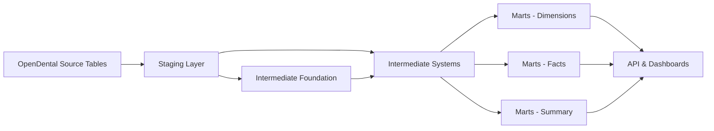

# 📊 dbt Documentation & Lineage Strategy
## Professional Portfolio Documentation

---

## **1. OVERVIEW**

This document outlines the strategy for generating, deploying, and maintaining comprehensive dbt
 documentation and lineage graphs for the dental analytics platform. This documentation serves as
  a professional showcase of data engineering capabilities.

---

## **2. CURRENT PROJECT STRUCTURE**

### Model Architecture (150+ Models)

```
dbt_dental_models/
├── staging/ (88 models)
│   ├── opendental/
│   │   ├── _sources/
│   │   │   ├── patient_sources.yml
│   │   │   ├── claims_sources.yml
│   │   │   ├── billing_sources.yml
│   │   │   ├── insurance_sources.yml
│   │   │   ├── core_config_sources.yml
│   │   │   └── ... (10+ source definition files)
│   │   └── stg_opendental__*.sql (88 staging models)
│   └── raw/
│       └── stg_etl_tracking_summary.sql
│
├── intermediate/ (50+ models)
│   ├── foundation/
│   │   ├── int_patient_profile.sql
│   │   └── int_provider_profile.sql
│   ├── system_a_fee_processing/
│   │   ├── int_fee_model.sql
│   │   ├── int_procedure_complete.sql
│   │   └── int_adjustments.sql
│   ├── system_b_insurance/
│   │   ├── int_insurance_coverage.sql
│   │   ├── int_claim_details.sql
│   │   ├── int_claim_payments.sql
│   │   ├── int_claim_tracking.sql
│   │   ├── int_claim_snapshot.sql
│   │   ├── int_insurance_employer.sql
│   │   └── int_insurance_eob_attachments.sql
│   ├── system_c_payment/
│   │   ├── int_payment_split.sql
│   │   ├── int_patient_payment_allocated.sql
│   │   └── int_insurance_payment_allocated.sql
│   ├── system_d_ar_analysis/
│   │   ├── int_ar_balance.sql
│   │   ├── int_ar_analysis.sql
│   │   ├── int_ar_transaction_history.sql
│   │   ├── int_ar_aging_snapshot.sql
│   │   └── int_ar_shared_calculations.sql
│   ├── system_e_collection/
│   │   ├── int_billing_statements.sql
│   │   ├── int_statement_metrics.sql
│   │   ├── int_collection_campaigns.sql
│   │   ├── int_collection_communication.sql
│   │   ├── int_collection_metrics.sql
│   │   └── int_collection_tasks.sql
│   ├── system_f_communications/
│   │   ├── int_patient_communications_base.sql
│   │   ├── int_communication_templates.sql
│   │   ├── int_communication_metrics.sql
│   │   ├── int_automated_communications_simple.sql
│   │   └── int_automated_communication_flags_simple.sql
│   ├── system_g_scheduling/
│   │   ├── int_appointment_details.sql
│   │   ├── int_appointment_schedule.sql
│   │   ├── int_appointment_metrics.sql
│   │   ├── int_provider_availability.sql
│   │   ├── int_task_management.sql
│   │   └── int_user_preferences.sql
│   └── system_h_logging/
│       └── int_opendental_system_logs.sql
│
└── marts/ (17 models)
    ├── Dimension Tables (7 models)
    │   ├── dim_patient.sql
    │   ├── dim_provider.sql
    │   ├── dim_procedure.sql
    │   ├── dim_insurance.sql
    │   ├── dim_clinic.sql
    │   ├── dim_fee_schedule.sql
    │   └── dim_date.sql
    │
    ├── Fact Tables (5 models)
    │   ├── fact_appointment.sql
    │   ├── fact_procedure.sql
    │   ├── fact_claim.sql
    │   ├── fact_payment.sql
    │   └── fact_communication.sql
    │
    └── Summary Marts (5 models)
        ├── mart_production_summary.sql
        ├── mart_ar_summary.sql
        ├── mart_revenue_lost.sql
        ├── mart_provider_performance.sql
        ├── mart_patient_retention.sql
        ├── mart_hygiene_retention.sql
        ├── mart_new_patient.sql
        └── mart_appointment_summary.sql
```

---

## **3. DATA LINEAGE FLOW**

### Source → Staging → Intermediate → Marts



### Detailed Lineage Patterns

#### **Pattern 1: Patient Journey**
```
raw.patient → stg_opendental__patient → int_patient_profile → dim_patient → fact_procedure → mart_production_summary
```

#### **Pattern 2: Insurance Claims**
```
raw.claim → stg_opendental__claim → int_claim_details → fact_claim → mart_revenue_lost
raw.claimproc → stg_opendental__claimproc ↗
raw.claimpayment → stg_opendental__claimpayment → int_claim_payments ↗
```

#### **Pattern 3: Financial Analysis**
```
raw.procedurelog → stg_opendental__procedurelog → int_procedure_complete → fact_procedure → mart_production_summary
raw.fee → stg_opendental__fee → int_fee_model ↗
raw.adjustment → stg_opendental__adjustment → int_adjustments ↗
```

#### **Pattern 4: AR Analysis**
```
Multiple sources → int_ar_balance → int_ar_analysis → mart_ar_summary
                 ↘ int_ar_transaction_history ↗
                 ↘ int_ar_aging_snapshot ↗
```

---

## **4. HOW TO GENERATE DBT DOCUMENTATION**

### Step 1: Generate Documentation Locally

```bash
# Navigate to dbt project directory
cd dbt_dental_models

# Generate documentation artifacts
dbt docs generate

# This creates:
# - target/manifest.json (full DAG and metadata)
# - target/catalog.json (table/column information)
# - target/run_results.json (test results)
```

### Step 2: Serve Documentation Locally

```bash
# Start local web server for documentation
dbt docs serve --port 8080

# Opens browser to http://localhost:8080
# Interactive lineage graph available
```

### Step 3: Explore Documentation Features

The generated documentation includes:

✅ **Interactive Lineage Graph (DAG)**
- Visual representation of all 150 models
- Click on any model to see:
  - Upstream dependencies (what feeds this model)
  - Downstream dependencies (what uses this model)
  - Model code
  - Compiled SQL
  - Column documentation

✅ **Data Dictionary**
- All table and column descriptions
- Data types
- Tests applied
- Freshness checks

✅ **Test Results**
- Which tests passed/failed
- Data quality metrics
- Referential integrity checks

✅ **Source Freshness**
- When data was last loaded
- Freshness SLA status

---

## **5. DOCUMENTATION DEPLOYMENT OPTIONS**

### Option 1: dbt Cloud (RECOMMENDED for Professional Portfolio)

**Setup Steps:**

1. **Create dbt Cloud Account** (free for 1 developer)
   - Go to https://cloud.getdbt.com
   - Sign up with GitHub account
   - Create new project

2. **Connect Git Repository**
   - Connect to your GitHub repo: `BenjaminRains/dbt_dental_clinic`
   - Select `dbt_dental_models` as project subdirectory
   - Configure branch (main)

3. **Configure Database Connection**
   - **For Production:** Connect to `opendental_analytics` (keep private)
   - **For Demo:** Connect to `opendental_demo` (synthetic data - can be public)

4. **Set Up dbt Cloud Environment**
   ```yaml
   # dbt Cloud will use your profiles.yml settings
   # But you'll configure via UI:
   
   Database: opendental_demo  # Your synthetic data database
   Schema: raw
   Host: <your-cloud-postgres-host>
   Port: 5432
   User: demo_user
   Password: <secure-password>
   ```

5. **Run dbt in Cloud**
   - Create job: "Generate Documentation"
   - Commands:
     ```bash
     dbt deps
     dbt seed
     dbt run
     dbt test
     dbt docs generate
     ```
   - Schedule: Daily or manual trigger

6. **Access Public Documentation**
   - dbt Cloud generates public documentation URL
   - Share this URL on your resume/portfolio
   - Example: `https://cloud.getdbt.com/accounts/123/jobs/456/docs/`

**Pros:**
- ✅ Professional presentation
- ✅ Hosted by dbt (no maintenance)
- ✅ Public shareable link
- ✅ Auto-updates when you push code
- ✅ Shows lineage, tests, freshness
- ✅ Industry-standard tool

**Cons:**
- ⚠️ Requires database connection (use synthetic data)
- ⚠️ Free tier: 1 developer, 5 models run per month (may need paid tier)

---

### Option 2: Static Site Hosting (GitHub Pages / Netlify)

**Setup Steps:**

1. **Generate Documentation Locally**
   ```bash
   cd dbt_dental_models
   dbt docs generate
   ```

2. **Extract Static Files**
   ```bash
   # Create docs hosting directory
   mkdir -p ../dbt_docs_static
   
   # Copy generated files
   cp target/manifest.json ../dbt_docs_static/
   cp target/catalog.json ../dbt_docs_static/
   cp target/run_results.json ../dbt_docs_static/
   
   # Copy dbt docs template
   # (Need to extract from dbt installation)
   ```

3. **Deploy to GitHub Pages**
   ```bash
   # Create gh-pages branch
   git checkout -b gh-pages
   
   # Add documentation files
   git add dbt_docs_static/*
   git commit -m "Add dbt documentation"
   git push origin gh-pages
   
   # Enable GitHub Pages in repo settings
   # URL: https://benjaminrains.github.io/dbt_dental_clinic/
   ```

**Pros:**
- ✅ Free hosting
- ✅ No database connection needed
- ✅ Full control over presentation
- ✅ Fast loading

**Cons:**
- ⚠️ Manual updates required
- ⚠️ More technical setup
- ⚠️ Need to extract dbt docs HTML template

---

### Option 3: dbt Documentation as Screenshots/PDFs

**Setup Steps:**

1. **Generate Documentation Locally**
   ```bash
   dbt docs generate
   dbt docs serve
   ```

2. **Capture Key Views**
   - Full DAG lineage graph
   - Key model details (dim_patient, fact_procedure, etc.)
   - Test results summary
   - Source freshness

3. **Create Documentation PDF**
   - Export lineage as PNG/SVG
   - Screenshot model documentation
   - Compile into portfolio PDF

4. **Store in GitHub**
   ```bash
   mkdir -p docs/dbt/screenshots
   # Add screenshots
   git add docs/dbt/screenshots/*
   git commit -m "Add dbt documentation screenshots"
   ```

**Pros:**
- ✅ Simple and fast
- ✅ No hosting required
- ✅ Easy to share (PDF)

**Cons:**
- ⚠️ Not interactive
- ⚠️ Static snapshot only
- ⚠️ Less impressive than live docs

---

## **6. KEY DOCUMENTATION TO CAPTURE**

### Critical Tables for Synthetic Data

Based on your 150 models, these are the **minimum required source tables** for full lineage:

#### **Tier 1: Absolute Must-Have (Core Dimensions)**
```
✅ patient (5,000 records) - Foundation of everything
✅ provider (12 records) - All financial & clinical models need this
✅ clinic (5 records) - Multi-location support
✅ procedurecode (200 records) - Procedure classification
✅ definition (500 records) - Lookup values
```

#### **Tier 2: Clinical & Scheduling (Intermediate Layer Support)**
```
✅ appointment (15,000 records) - Scheduling, fact_appointment
✅ procedurelog (20,000 records) - Core financial transactions
✅ fee (600 records) - Fee schedules
✅ feesched (3 records) - Fee schedule definitions
✅ adjustment (2,000 records) - Adjustments and write-offs
```

#### **Tier 3: Insurance & Claims (Financial Analysis)**
```
✅ carrier (15 records) - Insurance companies
✅ insplan (30 records) - Insurance plans
✅ inssub (2,000 records) - Subscriber information
✅ patplan (3,500 records) - Patient insurance assignments
✅ claim (8,000 records) - Insurance claims
✅ claimproc (25,000 records) - Claim procedures
✅ claimpayment (5,000 records) - Insurance payments
```

#### **Tier 4: Payments & AR (Complete Financial Picture)**
```
✅ payment (12,000 records) - Patient payments
✅ paysplit (15,000 records) - Payment allocations
```

#### **Tier 5: Supporting Data (Enhanced Analytics)**
```
✅ commlog (8,000 records) - Communications
✅ recall (3,000 records) - Recall appointments
✅ patientnote (5,000 records) - Patient notes
✅ patientlink (1,000 records) - Family relationships
✅ document (5,000 records) - Document metadata
✅ sheet (2,000 records) - Forms
✅ task (1,000 records) - Task management
```

**Total: ~30 core tables to support all 150 models**

---

## **7. MODELS THAT FEED DASHBOARDS**

### API Endpoints → dbt Marts Mapping

From your `api/routers/` directory:

#### **Dashboard KPIs** (`/reports/dashboard/`)
**Source Marts:**
- `mart_production_summary` - Daily production metrics
- `mart_ar_summary` - AR aging and collection metrics
- `mart_provider_performance` - Provider productivity
- `dim_patient` - Patient demographics

**Key Metrics:**
- Total production (today, MTD, YTD)
- Collections (today, MTD, YTD)
- AR aging (current, 30, 60, 90+ days)
- New patients (today, MTD, YTD)
- Provider productivity

---

#### **Revenue Analytics** (`/reports/revenue/`)
**Source Marts:**
- `mart_revenue_lost` - Uncollected revenue analysis
- `mart_production_summary` - Production by provider/clinic
- `fact_procedure` - Procedure-level revenue
- `fact_payment` - Payment transactions

**Key Metrics:**
- Revenue lost by category
- Recovery potential
- Collection rate by provider
- Production trends over time

---

#### **Provider Performance** (`/reports/providers/`)
**Source Marts:**
- `mart_provider_performance` - Provider-specific metrics
- `mart_production_summary` - Production by provider
- `fact_procedure` - Procedures by provider
- `dim_provider` - Provider details

**Key Metrics:**
- Production per provider
- Collection rate
- Patient satisfaction
- Procedure mix

---

#### **Patient Analytics** (`/patients/`)
**Source Marts:**
- `dim_patient` - Patient demographics
- `mart_patient_retention` - Retention metrics
- `mart_new_patient` - New patient analysis
- `mart_hygiene_retention` - Hygiene recall adherence
- `fact_appointment` - Appointment history

**Key Metrics:**
- Patient demographics
- Retention rate
- Lifetime value
- Appointment adherence

---

#### **AR Management** (`/reports/ar/`)
**Source Marts:**
- `mart_ar_summary` - AR aging summary
- `int_ar_balance` - Patient balances
- `int_ar_aging_snapshot` - Historical AR trends
- `int_collection_metrics` - Collection effectiveness

**Key Metrics:**
- AR by aging bucket
- Collection rate
- Payment plans
- Write-offs

---

### Lineage: Source → Staging → Intermediate → Mart → API → Dashboard

```
Example: Revenue Dashboard Production Metric

raw.procedurelog (MySQL)
  ↓
stg_opendental__procedurelog (Staging)
  ↓
int_procedure_complete (Intermediate)
  ↓
fact_procedure (Mart - Fact)
  ↓
mart_production_summary (Mart - Summary)
  ↓
api/routers/reports.py → get_revenue_analytics()
  ↓
frontend/src/pages/Revenue.tsx → ProductionChart
```

---

## **8. COMPLEX BUSINESS LOGIC & KEY JOINS**

### Critical Business Logic Examples

#### **1. AR Aging Calculation** (`int_ar_balance.sql`)
```sql
-- Complex aging bucket logic
CASE 
    WHEN days_outstanding <= 30 THEN 'current'
    WHEN days_outstanding <= 60 THEN '30_days'
    WHEN days_outstanding <= 90 THEN '60_days'
    ELSE '90_plus_days'
END as aging_bucket

-- Guarantor-level aggregation
SUM(CASE WHEN guarantor_id IS NOT NULL 
    THEN patient_balance 
    ELSE 0 END) as family_balance
```

#### **2. Insurance Claim Matching** (`int_claim_details.sql`)
```sql
-- Complex join: procedure → claim → claimproc → payment
FROM stg_opendental__procedurelog proc
LEFT JOIN stg_opendental__claimproc cp 
    ON proc.procedure_id = cp.procedure_id
LEFT JOIN stg_opendental__claim c 
    ON cp.claim_id = c.claim_id
LEFT JOIN stg_opendental__claimpayment cpay 
    ON c.claim_payment_id = cpay.claim_payment_id

-- Status logic
CASE c.claim_status
    WHEN 'S' THEN 'Sent'
    WHEN 'R' THEN 'Received'
    WHEN 'P' THEN 'Paid'
    -- ... 10+ status codes
END as claim_status_description
```

#### **3. Payment Allocation** (`int_payment_split.sql`)
```sql
-- Split payments across multiple procedures
SELECT 
    payment_id,
    procedure_id,
    split_amount,
    -- Calculate % of payment allocated to each procedure
    split_amount / SUM(split_amount) OVER (PARTITION BY payment_id) 
        as pct_of_payment,
    -- Running total for this payment
    SUM(split_amount) OVER (
        PARTITION BY payment_id 
        ORDER BY split_date
    ) as running_payment_total
FROM stg_opendental__paysplit
```

#### **4. Production vs Collections** (`mart_production_summary.sql`)
```sql
-- Production: Procedures completed (fee charged)
SUM(proc.procedure_fee) as total_production,

-- Collections: Actual payments received
SUM(pay.payment_amount) as total_collections,

-- Collection Rate
SUM(pay.payment_amount) / NULLIF(SUM(proc.procedure_fee), 0) 
    as collection_rate,

-- Outstanding AR
SUM(proc.procedure_fee) - SUM(COALESCE(pay.payment_amount, 0)) 
    as outstanding_ar
```

#### **5. Patient Retention** (`mart_patient_retention.sql`)
```sql
-- Cohort analysis: patients who returned within 6 months
WITH first_visit AS (
    SELECT patient_id, MIN(appointment_date) as first_date
    FROM fact_appointment
    WHERE appointment_status = 'Completed'
    GROUP BY patient_id
),
return_visit AS (
    SELECT 
        fv.patient_id,
        MIN(fa.appointment_date) as return_date
    FROM first_visit fv
    JOIN fact_appointment fa 
        ON fv.patient_id = fa.patient_id
        AND fa.appointment_date > fv.first_date
        AND fa.appointment_date <= fv.first_date + INTERVAL '6 months'
    WHERE fa.appointment_status = 'Completed'
    GROUP BY fv.patient_id
)
SELECT 
    COUNT(DISTINCT fv.patient_id) as total_new_patients,
    COUNT(DISTINCT rv.patient_id) as returned_patients,
    COUNT(DISTINCT rv.patient_id)::float / 
        COUNT(DISTINCT fv.patient_id) as retention_rate
FROM first_visit fv
LEFT JOIN return_visit rv ON fv.patient_id = rv.patient_id
```

---

## **9. IMPLEMENTATION PLAN**

### Phase 1: Local Documentation (Immediate)

**Tasks:**
1. Generate dbt docs locally
2. Explore lineage and identify gaps
3. Capture key screenshots
4. Document complex business logic

**Commands:**
```bash
cd dbt_dental_models
dbt docs generate
dbt docs serve --port 8080
```

**Deliverables:**
- Full understanding of model dependencies
- Screenshots of key lineage paths
- List of required tables for synthetic data

---

### Phase 2: Synthetic Data Integration (After synthetic data generator)

**Tasks:**
1. Connect dbt to `opendental_demo` database
2. Run all 150 models against synthetic data
3. Fix any data issues
4. Re-generate documentation with synthetic data

**Commands:**
```bash
# Update profiles.yml to point to demo database
export POSTGRES_ANALYTICS_DB=opendental_demo

# Run full pipeline
dbt deps
dbt run --full-refresh
dbt test
dbt docs generate
```

**Deliverables:**
- All 150 models running successfully on synthetic data
- Complete documentation with real lineage
- Test results showing data quality

---

### Phase 3: Cloud Deployment (Professional Portfolio)

**Tasks:**
1. Deploy synthetic database to cloud (Render/Supabase)
2. Set up dbt Cloud account
3. Connect dbt Cloud to GitHub and cloud database
4. Configure job to generate documentation
5. Get public documentation URL

**Commands:**
```bash
# In dbt Cloud UI:
1. Create new project
2. Connect to GitHub: BenjaminRains/dbt_dental_clinic
3. Set subdirectory: dbt_dental_models
4. Configure database connection (cloud PostgreSQL)
5. Create job: "Daily Documentation"
6. Add commands:
   - dbt deps
   - dbt run
   - dbt test
   - dbt docs generate
7. Run job
8. Get public docs URL
```

**Deliverables:**
- Live public dbt documentation
- Shareable URL for portfolio/resume
- Auto-updating documentation on code changes

---

## **10. SUCCESS METRICS**

### Documentation Completeness
- ✅ All 150 models have descriptions
- ✅ All key columns documented
- ✅ Business logic explained
- ✅ Lineage graph shows full DAG
- ✅ Test results visible

### Professional Presentation
- ✅ Public URL available
- ✅ Clean and professional appearance
- ✅ No errors or warnings
- ✅ Demonstrates technical depth
- ✅ Shows business understanding

### Technical Metrics
- ✅ 150/150 models compiled
- ✅ 150/150 models executed successfully
- ✅ 100% test coverage on key models
- ✅ Source freshness checks passing

---

## **11. PORTFOLIO VALUE**

### What This Demonstrates

**Technical Skills:**
- ✅ dbt modeling expertise (150+ models)
- ✅ Data warehousing (dimensional modeling)
- ✅ SQL proficiency (complex joins, window functions)
- ✅ ETL/ELT pipeline design
- ✅ Data quality testing

**Business Skills:**
- ✅ Healthcare domain knowledge
- ✅ Financial analytics (revenue cycle)
- ✅ Operational metrics (scheduling, productivity)
- ✅ Requirements analysis

**Architecture Skills:**
- ✅ Layered architecture (staging → intermediate → marts)
- ✅ Modular design (systems-based organization)
- ✅ Scalability (90+ source tables → 150+ models)
- ✅ Maintainability (documented and tested)

---

## **12. NEXT STEPS**

### Immediate Actions (Today)

1. **Generate Local Documentation**
   ```bash
   cd dbt_dental_models
   dbt docs generate
   dbt docs serve
   ```

2. **Explore and Document**
   - Click through lineage graph
   - Identify critical paths
   - Screenshot key models
   - Document business logic

3. **Identify Required Tables**
   - List all source tables used by models
   - Prioritize for synthetic data generator
   - Document table volumes needed

### After Synthetic Data Generator (Week 5)

1. **Test Against Synthetic Data**
   ```bash
   export POSTGRES_ANALYTICS_DB=opendental_demo
   dbt run
   dbt test
   dbt docs generate
   ```

2. **Deploy to dbt Cloud**
   - Create account
   - Connect GitHub + Database
   - Generate public documentation
   - Share URL on resume/LinkedIn

### Long-Term Maintenance

1. **Keep Documentation Updated**
   - Update model descriptions as business logic changes
   - Add tests for new models
   - Document new complex joins

2. **Showcase in Portfolio**
   - Link to dbt Cloud docs from GitHub README
   - Add to LinkedIn projects
   - Include in resume under "Data Engineering" section

---

## **13. RESOURCES**

### dbt Documentation
- Official Docs: https://docs.getdbt.com/docs/collaborate/documentation
- dbt Cloud: https://cloud.getdbt.com
- Best Practices: https://docs.getdbt.com/guides/best-practices

### Portfolio Examples
- dbt Discourse (community): https://discourse.getdbt.com/
- Example public docs: Look for "dbt Jaffle Shop" examples

---

**Ready to generate your professional dbt documentation!** 🚀

This will be a key differentiator in your portfolio, showing both technical depth and business understanding.

