# Intermediate Models System Mapping

## Overview

This document provides a comprehensive mapping of all intermediate models in the dental clinic analytics system, organized by their respective systems and showing their dependencies and relationships.

## System Dependencies

```mermaid
graph TD
    %% Foundation Models
    F1[int_patient_profile] --> A1
    F1 --> B1
    F1 --> C1
    F1 --> D1
    F1 --> E1
    F1 --> F1
    F1 --> G1
    F2[int_provider_profile] --> A1
    F2 --> B1
    F2 --> C1
    F2 --> G1
    F3[int_ar_analysis] --> D1
    F4[int_opendental_system_logs] --> A1
    F4 --> B1
    F4 --> C1
    F4 --> D1
    F4 --> E1
    F4 --> F1
    F4 --> G1

    %% System A: Fee Processing
    subgraph SystemA[System A: Fee Processing]
        A1[int_adjustments]
        A2[int_procedure_complete]
        A3[int_fee_model]
    end

    %% System B: Insurance
    subgraph SystemB[System B: Insurance]
        B1[int_insurance_coverage]
        B2[int_insurance_employer]
        B3[int_insurance_eob_attachments]
        B4[int_claim_details]
        B5[int_claim_payments]
        B6[int_claim_snapshot]
        B7[int_claim_tracking]
    end

    %% System C: Payment
    subgraph SystemC[System C: Payment]
        C1[int_payment_split]
        C2[int_patient_payment_allocated]
        C3[int_insurance_payment_allocated]
    end

    %% System D: AR Analysis
    subgraph SystemD[System D: AR Analysis]
        D1[int_ar_analysis]
        D2[int_ar_shared_calculations]
        D3[int_ar_aging_snapshot]
        D4[int_ar_balance]
        D5[int_ar_transaction_history]
    end

    %% System E: Collections
    subgraph SystemE[System E: Collections]
        E1[int_billing_statements]
        E2[int_collection_metrics]
        E3[int_collection_communication]
        E4[int_collection_tasks]
        E5[int_collection_campaigns]
        E6[int_statement_metrics]
    end

    %% System F: Communications
    subgraph SystemF[System F: Communications]
        F1[int_patient_communications_base]
        F2[int_communication_metrics]
        F3[int_communication_templates]
        F4[int_automated_communications]
        F5[int_automated_communication_flags]
    end

    %% System G: Scheduling
    subgraph SystemG[System G: Scheduling]
        G1[int_appointment_details]
        G2[int_appointment_schedule]
        G3[int_appointment_metrics]
        G4[int_provider_availability]
        G5[int_task_management]
        G6[int_user_preferences]
    end

    %% Cross-System Models
    subgraph CrossSystem[Cross-System Models]
        CS1[int_treatment_journey]
        CS2[int_patient_financial_journey]
    end

    %% Dependencies
    A1 --> C1
    A2 --> C1
    A3 --> C1
    C1 --> D1
    C2 --> D1
    C3 --> D1
    D1 --> E1
    B1 --> D1
    B4 --> D1
    B5 --> C1
    B6 --> D1
    B7 --> D1
    F1 --> F2
    G1 --> G3
```

## Detailed Model Relationships

### Foundation Models
- `int_patient_profile`
  - Core patient information
  - Used by all patient-related models
  - Primary source for patient demographics

- `int_provider_profile`
  - Core provider information
  - Used by all provider-related models
  - Primary source for provider capabilities

- `int_ar_analysis`
  - Financial foundation
  - Used by AR and collections models
  - Primary source for financial reporting

- `int_opendental_system_logs`
  - System audit and monitoring
  - Used by all systems for tracking
  - Primary source for system activity

### System A: Fee Processing
- `int_adjustments`
  - Financial adjustments
  - Feeds into payment processing
  - Complex categorization logic

- `int_procedure_complete`
  - Procedure tracking
  - Feeds into payment processing
  - Procedure status management

- `int_fee_model`
  - Fee structure
  - Feeds into payment processing
  - Pricing management

### System B: Insurance
- `int_insurance_coverage`
  - Insurance plan details
  - Feeds into AR analysis
  - Coverage rules and benefits

- `int_insurance_employer`
  - Employer relationships
  - Supports insurance coverage
  - Group plan management

- `int_insurance_eob_attachments`
  - EOB document tracking
  - Supports claim processing
  - Document management

- `int_claim_details`
  - Claim information
  - Feeds into AR analysis
  - Claim processing logic

- `int_claim_payments`
  - Insurance payments
  - Feeds into payment processing
  - Payment tracking

- `int_claim_snapshot`
  - Claim status tracking
  - Feeds into AR analysis
  - Status management

- `int_claim_tracking`
  - Claim workflow
  - Feeds into AR analysis
  - Process tracking

### System C: Payment
- `int_payment_split`
  - Payment allocation
  - Feeds into AR analysis
  - Complex allocation logic

- `int_patient_payment_allocated`
  - Patient payments
  - Feeds into AR analysis
  - Payment tracking

- `int_insurance_payment_allocated`
  - Insurance payments
  - Feeds into AR analysis
  - Payment tracking

### System D: AR Analysis
- `int_ar_analysis`
  - AR reporting
  - Feeds into collections
  - Financial analysis

- `int_ar_shared_calculations`
  - Common calculations
  - Used by AR models
  - Shared logic

- `int_ar_aging_snapshot`
  - Aging analysis
  - Feeds into collections
  - Aging buckets

- `int_ar_balance`
  - Balance tracking
  - Feeds into AR analysis
  - Balance management

- `int_ar_transaction_history`
  - Transaction history
  - Feeds into AR analysis
  - History tracking

### System E: Collections
- `int_billing_statements`
  - Statement generation
  - Feeds into collections
  - Statement management

- `int_collection_metrics`
  - Collection performance
  - Uses AR data
  - Performance tracking

- `int_collection_communication`
  - Collection comms
  - Uses AR data
  - Communication tracking

- `int_collection_tasks`
  - Task management
  - Uses AR data
  - Task tracking

- `int_collection_campaigns`
  - Campaign tracking
  - Uses AR data
  - Campaign management

- `int_statement_metrics`
  - Statement performance
  - Uses AR data
  - Performance tracking

### System F: Communications
- `int_patient_communications_base`
  - Communication events
  - Feeds into metrics
  - Event tracking

- `int_communication_metrics`
  - Communication performance
  - Uses base data
  - Performance tracking

- `int_communication_templates`
  - Template management
  - Used by communications
  - Template tracking

- `int_automated_communications`
  - Automated comms
  - Uses templates
  - Automation tracking

- `int_automated_communication_flags`
  - Communication triggers
  - Used by automation
  - Trigger management

### System G: Scheduling
- `int_appointment_details`
  - Appointment tracking
  - Feeds into metrics
  - Detail management

- `int_appointment_schedule`
  - Schedule management
  - Uses details
  - Schedule tracking

- `int_appointment_metrics`
  - Appointment performance
  - Uses details
  - Performance tracking

- `int_provider_availability`
  - Provider scheduling
  - Used by scheduling
  - Availability tracking

- `int_task_management`
  - Task tracking
  - Used by scheduling
  - Task management

- `int_user_preferences`
  - User settings
  - Used by scheduling
  - Preference management

### Cross-System Models
- `int_treatment_journey`
  - Treatment tracking
  - Uses multiple systems
  - Journey management

- `int_patient_financial_journey`
  - Financial tracking
  - Uses multiple systems
  - Journey management

## Key Integration Points

1. **Patient Data Flow**
   - Foundation → All Systems
   - Patient Profile → AR → Collections
   - Patient Profile → Communications
   - Patient Profile → Scheduling

2. **Provider Data Flow**
   - Foundation → Fee Processing
   - Foundation → Insurance
   - Foundation → Scheduling

3. **Financial Data Flow**
   - Fee Processing → Payment → AR → Collections
   - Insurance → Payment → AR → Collections
   - AR → Collections → Communications

4. **Operational Data Flow**
   - Scheduling → Communications
   - Collections → Communications
   - Insurance → Communications

## Data Quality Considerations

1. **Critical Paths**
   - Patient Profile → AR Analysis
   - Payment Processing → AR Analysis
   - AR Analysis → Collections

2. **Data Validation Points**
   - Foundation Models
   - Payment Processing
   - AR Analysis
   - Collections Processing

3. **Business Rule Enforcement**
   - Insurance Coverage Rules
   - Payment Allocation Rules
   - AR Aging Rules
   - Collection Process Rules

## Performance Considerations

1. **High-Volume Models**
   - Payment Processing
   - AR Analysis
   - Communications Base
   - Appointment Details

2. **Complex Calculations**
   - AR Analysis
   - Collection Metrics
   - Communication Metrics
   - Appointment Metrics

3. **Integration Points**
   - Foundation to System Models
   - Financial System Integration
   - Operational System Integration 