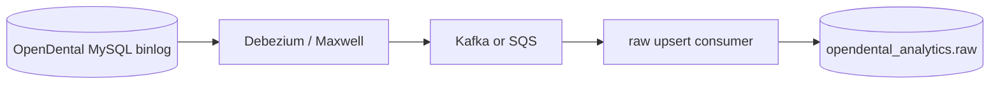

# ETL replica fidelity roadmap (pre-CDC)

**Context:** [ETL-FND-001](findings/ETL-FND-001-replica-row-drift-procedurelog.md) showed that watermark incremental sync + upsert **misses in-place row updates** when the pipeline’s “change signal” does not advance. `procedurelog` was the first KPI to prove it; insurance, payments, claims, communications, and patient tables are likely in the same class.

**Goal:** Close the **implementation gap** between `tables.yml` intent and replicator/loader behavior, add **Layer 0** observability, and use **Sunday full refresh** as a cheap safety net — **before** committing to binlog/CDC.

**Tracking:** [TODO.md — ETL-FND-001](../../TODO.md#etl-fnd-001--replica-row-drift-procedurelog)

---

## Implementation status (branch `fix/etl-fnd-001-procedurelog-row-drift`)

| Phase | Status | Local verification |
| --- | --- | --- |
| **1** — Schema analyzer + `tables.yml` v4.1 | **Done** (commit `558e50d7`) | `procedurelog`: `DateTStamp` watermark, `or_logic`, 30-day lookback in config |
| **2** — Replicator + loader alignment | **Done** (commit `6cc4e6f9`) | Incremental ~10,632 rows (~2s replicate + ~1.2 min load) vs ~815k rows pre-fix; drift check PASS; KPI 2026-06-10 PASS (28 codes, 140 / $15,239) |
| **3** — Layer 0 checks (payment, claimproc, adjustment, claim, paysplit) | **Done** (local) | Tier A — 6 checks PASS; lookback on claim/paysplit; phantom purge scripts |
| **4** — Sunday scoped full refresh | Not started | — |
| **1.5** — Spot-edit timestamp matrix | Not started | Required before trusting config clinic-wide |

**Next:** clinic RDS deploy + re-validate; 2+ additional golden dates; Phase 3 Layer 0.

---

## Problem summary

| Assumption (design) | Reality (code + OD) |
| --- | --- |
| `DateTStamp` updates when any column changes | **Unverified** per table; no MySQL triggers in OpenDental |
| `primary_incremental_column` drives “what changed” | **`analyze_opendental_schema.py` prefers auto-increment PK** over `DateTStamp` |
| Replicator honors `incremental_strategy` (`and_logic`) | Replicator uses **`primary_incremental_column` only** → effectively `ProcNum > watermark` for `procedurelog` |
| Loader matches replicator | Loader applies **`and_logic`** on PK + timestamp — stricter, different shape |
| Incremental = durable | **Append-only** tables OK; **in-place mutation** tables drift until full refresh or lookback |

**Mutation-prone domains (prioritize review):**

- **Clinical / production:** `procedurelog`, treatment status, fees
- **Insurance / claims:** `claim`, `claimproc`, `patplan`, `insplan`-related facts
- **Payments / AR:** `payment`, `adjustment`, `paysplit`, `payplan`
- **Communications:** `commlog`, `email`, `sms*` (if modeled)
- **Patient / account:** `patient`, `account`, demographic and balance fields

---

## Phase 1 — Fix config generation (`analyze_opendental_schema.py`)

**Status:** **Done** (2026-06-26, local) — analyzer v4.1 emits `sync_profile`, `replicator_watermark_column`, `lookback_resync`; `tables.yml` regenerated on laptop via `mdc etl schema --env local`.

**Owner:** schema analyzer + `tables.yml` contract  
**Effort:** 1–2 days code + regen `tables.yml` + spot validation  
**Do before:** broad Layer 0 rollout or Sunday full refresh tuning

### 1.1 Table sync profile (new `tables.yml` fields)

Add explicit metadata per table (analyzer output):

```yaml
sync_profile: append_only | in_place_updates   # default from table class
replicator_watermark_column: DateTStamp       # column replicator uses for "changed since last run"
loader_incremental_strategy: or_logic | and_logic | single_column
lookback_resync:                              # optional; procedurelog pattern
  enabled: true
  window_days: 30
  predicate_columns: [DateComplete, ProcDate]
```

**Rules (analyzer):**

| Profile | When | `replicator_watermark_column` | `primary_incremental_column` (legacy) |
| --- | --- | --- | --- |
| `append_only` | Log-style tables, new PK per event | PK OK for **new row** capture | PK |
| `in_place_updates` | Conservative list + modeled marts + known mutation tables | **`DateTStamp` or `SecDateTEdit`** (first that passes quality) | Same as watermark (deprecate PK-as-watermark) |

**Conservative / mutation seed list** (extend over time):

`procedurelog`, `claimproc`, `payment`, `adjustment`, `claim`, `patplan`, `paysplit`, `commlog`, `patient`

### 1.2 Fix `select_primary_incremental_column()`

Today: auto-increment PK **wins** over `DateTStamp` → wrong for mutation tables.

**Change:**

- If `sync_profile == in_place_updates` → return best timestamp column (`DateTStamp`, `SecDateTEdit`, …), **never PK**.
- If `append_only` → PK watermark remains valid for “new inserts only.”
- Emit analyzer **warning** when PK was previously primary on a mutation table.

### 1.3 Align `determine_incremental_strategy()`

- **`and_logic` on mutation tables:** misleading today (replicator ignores it). Options:
  - **A (recommended):** mutation tables → `or_logic` on loader; replicator uses **timestamp-only** watermark.
  - **B:** implement `and_logic` in replicator (heavier).
- Document in generated `tables.yml` comment which code paths consume each field.

### 1.4 Regenerate + diff

From your laptop (VPN to clinic OpenDental; loads `etl_pipeline/.env_local`):

```powershell
mdc etl test-connections --env local --profile full
mdc etl schema --env local
# Review diff: primary_incremental_column flips PK → DateTStamp on mutation tables
```

On clinic EC2 / Airflow the same analyzer runs with `--env clinic` (nightly DAG).

### 1.5 Spot-edit verification matrix (manual, one-time)

Before trusting new config clinic-wide:

| Table | Edit in OD | Re-query `DateTStamp` / `SecDateTEdit` |
| --- | --- | --- |
| `procedurelog` | TP → Complete | ? |
| `payment` | amount / pay date tweak | ? |
| `claimproc` | status / ins pay change | ? |
| `adjustment` | amount edit | ? |
| `patient` | phone / address | ? |
| `commlog` | status change | ? |

Record results in this doc or ETL-FND-001. If timestamp **never** moves → timestamp watermark alone is insufficient; rely on lookback + Sunday full refresh until CDC.

---

## Phase 2 — Replicator vs loader consistency

**Status:** **Done** (2026-06-27, local) — shared `replica_sync_config.py`; replicator uses `replicator_watermark_column`; loader timestamp-only WHERE for `in_place_updates`; config-driven lookback; streaming upsert for mutation tables.

**Effort:** 2–3 days  
**Depends on:** Phase 1 fields in `tables.yml`

### 2.1 Replicator (`simple_mysql_replicator.py`)

| Today | Target |
| --- | --- |
| Incremental batch: `primary_incremental_column > cursor` (often PK) | Use `replicator_watermark_column` (timestamp) for mutation tables |
| `and_logic` not implemented | Read `loader_incremental_strategy` OR split replicator-specific strategy |
| Lookback only on `procedurelog` hard-coded | Read `lookback_resync` from `tables.yml` |

**Incremental query shape (mutation tables):**

```sql
SELECT * FROM `{table}`
WHERE `{watermark_col}` > :last_watermark
   OR `{watermark_col}` = :last_watermark AND `{pk}` > :last_pk   -- tie-break for same second
ORDER BY `{watermark_col}`, `{pk}`
LIMIT :batch
```

Plus optional lookback OR union (procedurelog pattern).

### 2.2 Loader (`postgres_loader.py`)

| Today | Target |
| --- | --- |
| Builds `and_logic` from `incremental_columns` | Build from **`tables.yml` loader strategy** + same watermark column as replication |
| Lookback hard-coded for `procedurelog` | Generic `lookback_resync` block |
| `copy_csv` on large tables breaks upsert | Keep **streaming upsert** when lookback enabled or `sync_profile == in_place_updates` |

### 2.3 Consistency test (automated)

Unit test: for each mutation table in fixture `tables.yml`, assert replicator and loader WHERE clauses both reference **`replicator_watermark_column`**, not PK-only.

---

## Phase 3 — Platform Layer 0 checks

**Status:** **In progress** (2026-06-27) — Tier A config + `replica_aggregate_drift.py` +
`check-replica-drift` CLI + Airflow `layer0_replica_checks` task group (`--warn-only` rollout).

**Purpose:** Catch MySQL → `raw` drift **before** KPI golden compares (see [kpi/README Layer 0](../../dbt_dental_models/validation/kpi/README.md)).

**Effort:** 3–5 days for Tier A + Airflow wiring; Tier B/C incremental

### 3.1 Check tiers

| Tier | What | When | Fail mode |
| --- | --- | --- | --- |
| **A — Domain aggregates** | Business-meaningful totals (complete production, net pay, AR adjustments) MySQL vs `raw` over rolling window | Post-ETL nightly | Fail task / Slack |
| **B — Table row parity** | `COUNT(*)` or checksum on PK sample for mutation tables | Weekly or post-Sunday refresh | Warn → fail if persistent |
| **C — KPI preflight** | Existing compare SQL reduced to single “health” scalar per golden KPI | Before publish | Block publish |

### 3.2 Tier A checks (implement first)

| Check ID | Tables | Predicate (sketch) | Window |
| --- | --- | --- | --- |
| `L0-PROC-001` | `procedurelog` | `ProcStatus=2`, sum fees by `DateComplete` | 30 days — **done** (`check_procedurelog_drift`) |
| `L0-PAY-001` | `payment` | sum `PayAmt` by `PayDate` | 30 days |
| `L0-CLM-001` | `claimproc` | ins pay + writeoff totals by `DateCP` | 30 days — **done** (local) |
| `L0-CLAIM-001` | `claim` | `ClaimFee` + `InsPayAmt` by `DateService` | 30 days — **done** (local) |
| `L0-PAY-002` | `paysplit` | sum `SplitAmt` by `DatePay` | 30 days — **done** (local) |
| `L0-ADJ-001` | `adjustment` | sum `AdjAmt` by `AdjDate` | 30 days |
| `L0-PAT-001` | `patient` | optional: count active patients (low churn metric) | snapshot |

**Implementation pattern:** same as `etl_pipeline/monitoring/procedurelog_drift.py` — shared module `replica_aggregate_drift.py` + config YAML listing checks.

**CLI:**

```powershell
mdc etl invoke --env clinic -- check-replica-drift --tier A
mdc etl invoke --env clinic -- check-replica-drift --check L0-PAY-001 --warn-only
```

### 3.3 Airflow wiring

Add task group **`layer0_replica_checks`** in `etl_pipeline_dag.py`:

```
… → process_*_tables → layer0_replica_checks → dbt_build → publish …
```

- Default: `--warn-only` for new checks first week
- Flip to hard-fail per check after baseline green
- Skip on manual `force_full_refresh` run (checks run **after** refresh completes)

### 3.4 Layer 0 registry

Maintain `etl_pipeline/config/replica_drift_checks.yml`:

- check id, table, MySQL/Postgres WHERE + amount expressions, tolerance, enabled
- `L0-PROC-001` delegates to `procedurelog_drift.py` (same query as legacy CLI)

---

## Phase 4 — Sunday periodic full refresh

**Rationale:** Cheap safety net — resets drift accumulated Mon–Sat even if watermark/lookback miss edge cases. Acceptable if Sunday clinic load is low and runtime fits maintenance window.

**Existing schedule:** `schema_analysis_dag` — `0 2 * * 0` (Sunday 2 AM).

### 4.1 Option A — Branch inside nightly DAG (simplest)

`etl_pipeline_dag.py`:

- Detect Sunday run (`execution_date.weekday() == 6` or param `weekly_full_refresh: true`)
- Set `force_full_refresh=True` for ETL task group only
- Skip or shorten dbt on Sunday if full refresh + build exceeds window (run dbt Monday pre-open)

**Pros:** one DAG, one ops surface  
**Cons:** Sunday run time unpredictable (large tables)

### 4.2 Option B — Separate Sunday DAG (recommended)

New `etl_sunday_full_refresh_dag.py`:

| Property | Value |
| --- | --- |
| Schedule | `0 4 * * 0` (4 AM Central, after schema analysis) |
| Scope | `force_full_refresh=True` via `mdc etl run --env clinic -- --force` or category order |
| Prerequisites | WireGuard + optional RDS tunnel; schema analysis success |
| Follow-up | Layer 0 Tier A checks → `dbt build` (full-refresh critical staging?) → publish |

**Stagger Sunday:**

```
02:00  schema_analysis_dag     → regen tables.yml (Phase 1 config)
04:00  etl_sunday_full_refresh  → MySQL → replication → raw (full)
06:00  layer0 + dbt + publish   → or defer dbt to Mon 5 AM incremental
```

### 4.3 Scope control (keep it inexpensive)

Not all 446 tables need weekly full refresh:

| Category | Sunday strategy |
| --- | --- |
| **Mutation + modeled** (~15–30 tables) | Full refresh |
| **Large append-only** (`securitylog`, etc.) | Incremental only or quarterly full |
| **Tiny reference** | Full refresh (cheap) |

Drive list from `sync_profile: in_place_updates` + `is_modeled: true` in `tables.yml`.

### 4.4 Runtime estimate

- Measure one Sunday trial on clinic: log per-category duration from existing metrics
- If `procedurelog` full refresh > 1 hr, keep **lookback daily + full refresh weekly** hybrid

---

## Phase 5 — Binlog / CDC (sketch only — defer)

**When:** Phase 1–4 still show drift on timestamp-verified edits, or deletes/phantom rows block KPIs.

### 5.1 Target architecture



### 5.2 Scope

| Captures | Watermark incremental today |
| --- | --- |
| INSERT | ✅ |
| UPDATE (any column) | ⚠️ if watermark wrong |
| DELETE | ❌ |

### 5.3 Migration path (no big-bang)

1. **CDC shadow mode** — consumer writes to `raw_cdc.*` or flags rows; compare to watermark path
2. **Dual-write period** — KPI Layer 0 on both paths
3. **Cutover per table** — mutation tables first (`procedurelog`, `payment`, `claimproc`)
4. **Retire** watermark incremental for cutover tables

### 5.4 Dependencies (why it’s wide)

- MySQL binlog enabled on clinic server (OpenDental/hosting policy)
- Network path from clinic → consumer (VPN/EC2 agent)
- Upsert idempotency, schema evolution, operational monitoring
- dbt staging incremental strategy rewrite

**Decision gate:** complete Phase 1–4 + 2 extra KPI validations; revisit CDC if Layer 0 still fires weekly after Sunday full refresh.

---

## Recommended execution order (pre-CDC)

| Step | Work | Outcome |
| ---: | --- | --- |
| 1 | Spot-edit timestamp matrix (§1.5) | Know if timestamp watermark is viable |
| 2 | Phase 1 schema analyzer + regen `tables.yml` | **Done** — config matches mutation vs append semantics |
| 3 | Phase 2 replicator watermark fix | **Done** — MySQL → replication catches timestamp advances |
| 4 | Generalize lookback + loader upsert (procedurelog → config-driven) | **Done** — MySQL → raw for business-window edits |
| 5 | Layer 0 Tier A: payment, claimproc, adjustment | Detect drift before KPIs |
| 6 | Sunday full refresh DAG (Option B, scoped list) | Weekly reset safety net |
| 7 | Merge ETL-FND-001 branch; clinic ETL + publish | Production path validated |
| 8 | 2+ more production-by-procedure golden dates | KPI `within_tolerance` |
| 9 | CDC decision review | Only if 1–8 insufficient |

---

## Related artifacts

| Doc | Role |
| --- | --- |
| [ETL-FND-001](findings/ETL-FND-001-replica-row-drift-procedurelog.md) | First instance + acceptance criteria |
| [ETL_CDC_IMPLEMENTATION_AND_OPTIONS.md](ETL_CDC_IMPLEMENTATION_AND_OPTIONS.md) | Current watermark design + investigation methods |
| [CLINIC_ANALYTICS_WORKFLOW.md](../CLINIC_ANALYTICS_WORKFLOW.md) | Local dbt + publish |
| [airflow/NIGHTLY_RUN.md](../../airflow/NIGHTLY_RUN.md) | Nightly incremental semantics |
| [schema_analysis_dag.py](../../airflow/dags/schema_analysis_dag.py) | Sunday 2 AM schema regen |

---

*Document version: 1.1 (2026-06-27). Phase 1–2 implemented locally; clinic deploy and Phase 3–4 pending.*
