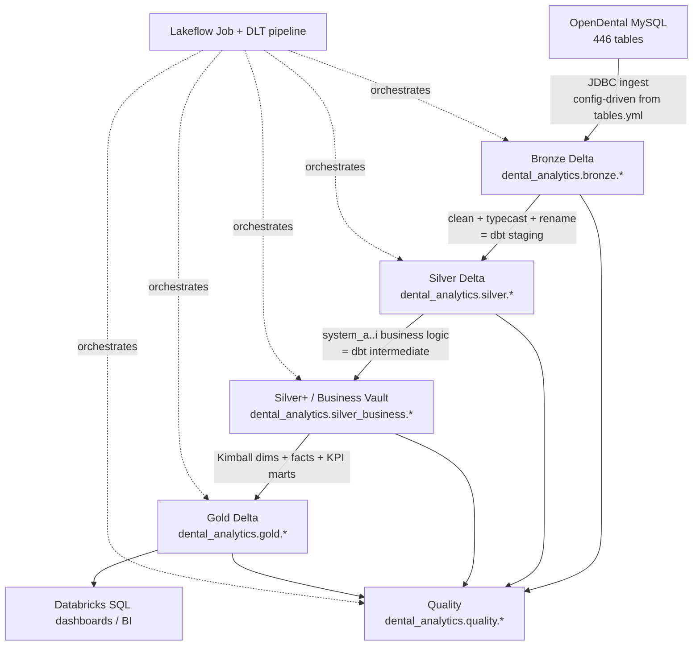

# Proposal: Rebuild the dbt + PostgreSQL Dental Analytics Stack as a Databricks Lakehouse

> **Status: DEV PROPOSAL / DRAFT.** Not scheduled for implementation. Parked for later refinement.
> Locked design decisions so far: **4-tier medallion** (Bronze / Silver / Silver+ / Gold),
> **Lakeflow Declarative Pipelines (DLT)** as the transformation framework,
> **JDBC-first ingestion** (direct JDBC reads from MySQL, config-driven from `tables.yml`;
> Auto Loader deferred to a scale-out stretch path — MDC/GLIC clinic volumes don't justify
> a file-landing + streaming layer today), and a **wave-1 starter scope of 8 Bronze tables**
> (patient, provider, appointment, procedurelog, procedurecode, payment, paysplit, claimproc;
> carrier + insplan follow as wave 2), and a **mart priority order**: `mart_ar_summary` first
> (the keystone — deepest dbt lineage), then `mart_daily_payments`, then `mart_provider_performance`.

## Objective

Build a Databricks lakehouse that **re-implements a representative slice of the existing OpenDental dental-analytics platform** — currently OpenDental/MySQL → Python ELT → PostgreSQL → dbt (`dbt_dental_models`) → FastAPI/React KPI app — using Delta Lake, PySpark, Unity Catalog, medallion architecture, Lakeflow orchestration, and a native data-quality framework.

This is a **parallel portfolio/migration-planning implementation**, not a production cutover. Success means a Databricks engineer (or interviewer) can trace a row from `raw.patient` all the way to a KPI like **DSO** or **Treatment Acceptance Rate** and see the same business logic expressed in Spark/Delta that exists today in dbt/Postgres.

---

## Current Architecture (as actually built)

```text
OpenDental / MySQL  (db: opendental, ~446 tables)
        │  SimpleMySQLReplicator  (extraction_strategy per tables.yml)
        ▼
MySQL replication landing  (db: opendental_replication)   ← tracking: etl_copy_status
        │  PostgresLoader  (standard | streaming | copy_csv, by estimated_size_mb)
        ▼
PostgreSQL  raw schema  (db: opendental_analytics)         ← tracking: etl_load_status / etl_transform_status
        │  dbt: staging  (91 stg_opendental__* models, schema=staging)
        ▼
        │  dbt: intermediate  (45 int_* models, system_a..i + foundation, schema=int)
        ▼
        │  dbt: marts  (8 dim_, 5 fact_, 14 mart_, schema=marts)
        ▼
FastAPI services + React app  (DSO, collection rate, tx acceptance, referral ROI, …)
```

Config-driven ingestion is the heart of the current system. `etl_pipeline/etl_pipeline/config/tables.yml` carries, per table: `extraction_strategy`, `incremental_columns` (watermarks like `AdjNum` + `SecDateTEdit`), `incremental_strategy` (`single_column` / `and_logic`), `batch_size` (1–100k), `performance_category` (tiny/small/medium/large), `processing_priority`, `time_gap_threshold_days`, `estimated_rows/size_mb`, and `is_modeled` / `dbt_model_types`. **This file is the artifact to port to Databricks.**

Core OpenDental subject areas (90 dbt-sourced tables of the 446) span: patients, appointments, providers, procedures (`procedurelog`/`procedurecode`), claims (`claim`/`claimproc`/`claimpayment`/`claimtracking`), payments & splits (`payment`/`paysplit`), adjustments, insurance (`insplan`/`inssub`/`patplan`/`benefit`/`carrier`), scheduling (`schedule`/`recall`), referrals (`referral`/`refattach`), and communications (`commlog`).

ETL metadata/tracking tables to be aware of:
- MySQL `etl_copy_status` (replication watermarks: `last_copied`, `last_primary_value`, `rows_copied`, `copy_status`).
- PostgreSQL `raw.etl_load_status` (`last_primary_value`, `rows_loaded`, `load_status`, `_loaded_at`).
- PostgreSQL `raw.etl_transform_status` (updated by dbt `on-run-start`/`on-run-end` hooks).

Note: the ETL copies OpenDental columns only into `raw`; staging adds metadata (`_loaded_at`, `_transformed_at`, `_created_at` from `SecDateEntry`, `_updated_at` from `DateTStamp`, `_created_by`) via the `standardize_metadata_columns` macro. The authoritative per-table load watermark lives in `raw.etl_load_status._loaded_at`, not on each raw row.

---

## Target Databricks Architecture



Medallion mapping to the existing layers (LOCKED: 4-tier):

| Existing layer | Postgres schema | Databricks layer | UC schema | DLT dataset type |
|---|---|---|---|---|
| ETL `raw` | `raw` | **Bronze** | `bronze` | materialized view (JDBC read; `MERGE` task for largest tables if needed) |
| dbt `staging` (rename/typecast/clean) | `staging` | **Silver** | `silver` | materialized view |
| dbt `intermediate` (`system_a..i`, `foundation`) | `int` | **Silver+ (business vault)** | `silver_business` | materialized view |
| dbt `marts` (`dim`/`fact`/`mart`) | `marts` | **Gold** | `gold` | materialized view |

The `system_a` (fee) … `system_i` (patient mgmt) decomposition is preserved. In DLT it survives as **named MV groups within the pipeline** (keep the `int_` names; tag each with a `domain` table property `system_a_fee` … `system_i_patient_mgmt`) so the DLT lineage graph visibly reproduces the dbt DAG.

### Why DLT throughout (vs. plain Spark notebooks)

DLT fills the dbt-shaped hole in the stack: one framework supplies the transformation layer, lineage graph, dependency management, and expectation framework, while integrating naturally with Lakeflow Jobs for orchestration.

Anticipated reviewer question — *"Why didn't you just write Spark notebooks?"*:

> The project is intentionally demonstrating how a production dbt architecture translates into Databricks-native capabilities. DLT is not just a transformation engine; it also exposes lineage, expectations, dependency management, and observability. Those are core aspects of the existing dbt platform, so using DLT throughout the medallion layers produces a closer conceptual mapping and a more compelling migration narrative.

(Plain notebooks would mean hand-rebuilding the DAG, testing, and incremental machinery dbt provides today; running dbt itself against Databricks SQL would demonstrate little Databricks-native engineering.)

---

## Phase 1: Project Setup

Version-controlled repo as a new top-level folder in this monorepo (`databricks_dental_lakehouse/`), beside `dbt_dental_models/` and `etl_pipeline/` for a direct before/after comparison:

```text
databricks_dental_lakehouse/
├── notebooks/
│   ├── 01_ingestion/        # bronze loaders (per source domain, mirrors _sources/*.yml)
│   ├── 02_silver/           # staging-equivalent cleaning
│   ├── 03_silver_business/  # intermediate-equivalent (system_a..i)
│   ├── 04_gold/             # dim / fact / mart
│   └── 05_validation/       # quality + reconciliation
├── src/
│   ├── config/
│   │   ├── tables.yml             # PORTED from etl_pipeline (subset to start)
│   │   └── settings.py            # catalog/schema/env resolution
│   ├── ingestion/                 # config-driven JDBC readers (= SimpleMySQLReplicator equiv)
│   ├── transforms/                # reusable Spark transforms (the macros equivalents)
│   └── quality/                   # expectation + reconciliation library
├── pipelines/                     # DLT pipeline python (bronze/silver/silver_business/gold)
├── sql/{bronze,silver,gold}/      # CREATE TABLE / DDL where declarative
├── resources/                     # DAB job + DLT pipeline YAML
│   └── lakeflow_jobs/
├── tests/                         # pytest + chispa unit tests for transforms
├── docs/
│   ├── mapping_to_dbt.md          # model-by-model crosswalk
│   └── architecture.md
├── README.md
└── databricks.yml                 # Databricks Asset Bundle root
```

Deliverable: `docs/mapping_to_dbt.md` — a crosswalk mapping every Databricks asset to its `dbt_dental_models` counterpart (e.g. `silver.patient` ⇄ `stg_opendental__patient.sql`, `gold.mart_ar_summary` ⇄ `marts/mart_ar_summary.sql`).

---

## Phase 2: Unity Catalog Layout

```text
catalog: dental_analytics       (or dental_analytics_dev / _test / _prod per environment)
schemas:
  bronze            # raw source-aligned Delta (mirrors Postgres raw)
  silver            # cleaned/renamed (= dbt staging)
  silver_business   # system_a..i business logic (= dbt intermediate)
  gold              # dim_/fact_/mart_ (= dbt marts)
  quality           # test_results, reconciliation, freshness, row_count_history
  audit             # ETL run metadata (= etl_copy_status / etl_load_status / etl_transform_status)
```

Naming carries over existing conventions:
- Bronze keeps OpenDental names: `bronze.patient`, `bronze.procedurelog`, `bronze.claimproc`, `bronze.paysplit`.
- Silver mirrors staging without the `stg_opendental__` prefix: `silver.patient`, `silver.appointment`, `silver.claimproc`.
- Silver+ mirrors intermediate names: `silver_business.int_procedure_complete`, `silver_business.int_payment_split`, `silver_business.int_ar_balance`, `silver_business.int_procedure_acceptance`, `silver_business.int_patient_referral_bridge`.
- Gold mirrors marts exactly: `gold.dim_patient`, `gold.fact_procedure`, `gold.mart_ar_summary`, `gold.mart_referral_source_kpis`.
- Keep the OpenDental `*Num` → `*_id` PK convention (`PatNum` → `patient_id`).

Deliverable: `sql/` DDL for catalog/schema creation + Delta table definitions with column comments (port descriptions from the `_*.yml`).

---

## Phase 3: Bronze Layer

Build Bronze Delta tables from OpenDental source extracts, in waves (LOCKED starter scope):

**Wave 1 — starter 8 tables** (core clinical + revenue cycle; enough for production, collections, and treatment-acceptance KPIs):
```text
patient, provider                            # who
appointment                                  # scheduling
procedurelog, procedurecode                  # production
payment, paysplit                            # collections
claimproc                                    # insurance payments/estimates at procedure grain
```

**Wave 2 — immediately after:** `carrier`, `insplan` (insurance dimension decode).

**Wave 3 — the `mart_ar_summary` closure** (AR is the first/keystone Gold mart; these complete its source set):
```text
adjustment                                   # AR adjustments (int_adjustments)
claim, claimpayment                          # claims lifecycle (int_claim_details/payments, fact_claim)
claimsnapshot, claimtracking                 # claim history/status (fact_claim)
definition                                   # categorical decode (used by nearly every int_ model)
fee, feesched                                # standard fees (int_procedure_complete)
inssub, patplan                              # patient↔plan linkage (int_insurance_coverage)
```
Enrichment-only sources referenced by the dbt AR lineage (`procnote`, `disease`, `document`, `patientlink`, `patientnote`, `insbluebook`/`insbluebooklog`, `eobattach`, `claimform`, `employer`, `insverify`, `benefit`) are deferred/stubbed at first — see Phase 5.

**Wave 4 — remaining marts:**
```text
referral, refattach                          # referral KPIs
schedule                                     # provider availability (mart_provider_performance hours)
histappointment, recall                      # hygiene/scheduling marts
patientnote, patientlink                     # patient enrichment
```

Carry over the config-driven ingestion design (the differentiator vs. a naive `spark.read` notebook):
- Port a trimmed `tables.yml` to `src/config/`. Reuse the same fields: `extraction_strategy` (`full_table` | `incremental` | `incremental_chunked`), `incremental_columns`, `primary_incremental_column`, `batch_size`, `performance_category`, `estimated_size_mb`.

**LOCKED JDBC-first ingestion (DLT-native; Auto Loader deferred):**

Rationale: MDC/GLIC clinic volumes are small enough that direct JDBC reads from MySQL are cheap. A file-landing zone + Auto Loader streaming would add operational surface (extract process, cloud storage layout, checkpoint management) with no payoff at this scale.

- **Default for all Bronze tables** → full-refresh **materialized views** over a Spark JDBC read of MySQL. One generic, config-driven loader iterates `tables.yml` and emits a DLT MV per table. No landing zone, no watermark state to manage.
- **Largest transactional tables** (`procedurelog`, `paysplit`, `claimproc`) → optional incremental path, still JDBC: push the `tables.yml` watermark predicate into the JDBC query (e.g. `adjustment` on `AdjNum` + `SecDateTEdit`, `incremental_strategy: and_logic`) and **`MERGE`** into the Bronze Delta table keyed on the natural PK. Watermarks persist to `audit.bronze_load_status` (same semantics as `etl_copy_status` / `etl_load_status`). Implement only if full-refresh runtimes warrant it.
- **Scale path (stretch, not now):** if volumes grow, swap the incremental tables to file extracts + Auto Loader streaming tables + `APPLY CHANGES INTO` (SCD type 1) without touching Silver+ — the Bronze contract (schema + metadata columns) stays identical.

Bronze metadata columns (extending the ETL tracking semantics):
```text
_ingested_at         (current_timestamp)
_source_system       ('opendental')
_source_table        (e.g. 'procedurelog')
_batch_id            (job/pipeline run id)
_file_name           (null for JDBC; reserved for the Auto Loader scale path)
_extraction_strategy (carried from tables.yml, for lineage)
```

Replace Postgres ETL tracking with an `audit` schema equivalent:
```text
audit.bronze_load_status   ≈ raw.etl_load_status   (last_primary_value, rows_loaded, load_status, _loaded_at)
audit.bronze_run_metrics   ≈ unified_metrics
```

Deliverables: bronze ingestion (DLT) per source domain, Delta DDL, bronze row-count validation (vs. source counts; mirrors `equal_rowcount` tests), freshness check writing to `quality.freshness_checks` (port the source thresholds: warn 24h / error 720h).

---

## Phase 4: Silver Layer (= dbt staging)

Each Silver table is the Databricks equivalent of one `stg_opendental__*` model:
- `*Num` → `*_id` renames; OpenDental `0/1` smallints → real booleans (the `boolean_values` macro).
- Replicate `standardize_metadata_columns` as a reusable Spark transform adding `_loaded_at`, `_transformed_at`, `_created_at` (from `SecDateEntry`), `_updated_at` (from `DateTStamp`), `_created_by`.
- Typecasting, null handling, date sanity (`max_valid_date = current_date`; `test_date_not_future`, `date_complete_valid` macros).
- Silver tables are DLT **materialized views** over Bronze (with batch JDBC Bronze there is no streaming source, so `APPLY CHANGES` doesn't apply; DLT refreshes MVs incrementally where it can). If the JDBC-incremental `MERGE` path is enabled for the largest tables, the analogous Silver `MERGE` keyed on the natural PK mirrors the ~44 incremental staging models filtering `> (select max(_loaded_at) from {{ this }})`.

Silver tables follow the Bronze waves. Wave 1:
```text
silver.patient        silver.provider         silver.appointment
silver.procedurelog   silver.procedurecode    silver.payment
silver.paysplit       silver.claimproc
```
Wave 2 adds `silver.carrier`, `silver.insplan`; wave 3 adds the AR closure (`silver.adjustment`, `silver.claim`, `silver.claimpayment`, `silver.claimsnapshot`, `silver.claimtracking`, `silver.definition`, `silver.fee`, `silver.feesched`, `silver.inssub`, `silver.patplan`); wave 4 fills out the rest (`silver.referral`, `silver.refattach`, `silver.schedule`, `silver.recall`, …).

Example responsibilities (from real staging logic):
```text
silver.patient      : normalize patient_status, derive age from birth_date,
                      active/inactive flags, guarantor_id, first_visit_date
silver.appointment  : appointment_status decode, is_completed / is_no_show / is_broken,
                      appointment_datetime, hygienist vs provider
silver.procedurelog : procedure_status (2=completed), actual_fee vs standard_fee,
                      date_complete validation, tooth number/surface validation
silver.paysplit     : split_amount, allocation target (procedure XOR adjustment XOR payplan),
                      unearned types 288/439 flags
```

---

## Phase 4b: Silver+ / Business Vault (= dbt intermediate, system_a..i)

Reproduce the domain decomposition — at minimum the models on the critical path to the five Gold marts:

| Existing intermediate model | Databricks table | Feeds Gold mart |
|---|---|---|
| `int_procedure_complete` | `silver_business.int_procedure_complete` | `fact_procedure`, production marts |
| `int_procedure_acceptance` | `silver_business.int_procedure_acceptance` | `mart_procedure_acceptance_summary` |
| `int_payment_split` | `silver_business.int_payment_split` | `fact_payment`, `mart_daily_payments` |
| `int_patient_payment_allocated` / `int_insurance_payment_allocated` | `silver_business.int_*_payment_allocated` | AR/collections reconciliation |
| `int_ar_balance` → `int_ar_analysis` → `int_ar_aging_snapshot` | `silver_business.int_ar_*` | `mart_ar_summary` |
| `int_claim_details` / `int_claim_payments` | `silver_business.int_claim_*` | `fact_claim`, `mart_claim_summary` |
| `int_patient_referral_bridge` | `silver_business.int_patient_referral_bridge` | `mart_referral_source_kpis` |
| `int_recall_management` | `silver_business.int_recall_management` | hygiene KPIs |
| `int_provider_profile` / `int_patient_profile` (foundation) | `silver_business.int_*_profile` | `dim_provider` / `dim_patient` |

These are DLT **materialized views**; the `system_a..i` labels become a `domain` table property.

---

## Phase 5: Gold Analytics Marts (use the real marts)

**LOCKED mart priority: `mart_ar_summary` first, then `mart_daily_payments`, then `mart_provider_performance`.** AR is the deepest mart in the dbt DAG — it forces the payment-allocation, adjustment, procedure-complete, and claim chains to exist. Once those Silver+ models are in place, the other marts are mostly assembly.

Reuse exact grains/names/formulas so the lakehouse is provably equivalent to production.

### 1. `gold.mart_ar_summary` (keystone — build first)
- **Grain:** `date × patient × provider`. Aging buckets `balance_0_30_days … balance_over_90_days`; `pct_current`, `pct_over_90`; `collection_priority_score` (0–100: balance 25 + aging 25 + payment recency 25 + insurance 25); `aging_risk_category` (High/Medium/Moderate/Low/Credit/None); `payment_recency`. **DSO/AR Days = ((balance_over_90 / total_ar) × 90) + 30.**
- **Upstream chain (this is why it's the keystone):** `int_ar_balance`/`int_ar_shared_calculations` ← `int_patient_payment_allocated` + `int_insurance_payment_allocated` + `int_adjustments` + `int_procedure_complete`; plus `fact_claim`, `fact_payment`, `dim_patient`, `dim_provider`, `dim_date` for enrichment.
- **Source-table closure (drives the Bronze waves):** wave-1 eight + `adjustment`, `claim`, `claimpayment`, `definition`, `carrier`, `fee`, `feesched`, `inssub`, `patplan`, `claimsnapshot`, `claimtracking`. Enrichment-only sources (`procnote`, `disease`, `document`, `patientlink`, `patientnote`, `insbluebook`/`insbluebooklog`, `eobattach`, `claimform`, `employer`, `insverify`, `benefit`) get deferred/stubbed first pass — document each simplification in `mapping_to_dbt.md`.

### 2. `gold.mart_daily_payments` (shallowest — quick second win)
- **Grain:** one row per `payment_date`; patient vs insurance vs other amounts/counts, `income_amount`, `refund_amount`, `net_collections_amount` — reconciles to OpenDental daily deposits.
- Upstream: just `fact_payment` ← `int_payment_split` — entirely covered by the AR build.

### 3. `gold.mart_provider_performance` (was "provider_productivity")
- **Grain:** `date × provider`
- **Metrics:** `total_production`, `total_collections`, `collection_efficiency = (collections/production)×100`, `production_per_hour = production/productive_hours`, `appointment_efficiency = (completed/scheduled)×100`, `daily_no_show_rate`, `daily_cancellation_rate`, `production_rank_specialty`/`_overall`, performance tiers (Excellent ≥98% collection, ≥95% scheduling, ≤5% no-show).
- Upstream: `mart_production_summary` + `mart_appointment_summary` (adds `fact_appointment` and `int_provider_availability` ← `schedule` — the only new source beyond the AR closure).

### Later marts (after the core three)
- `gold.mart_procedure_acceptance_summary` (was "treatment_journey"): daily × provider × clinic; `tx_acceptance_rate = (tx_accepted_amount/tx_presented_amount)×100`, `patient_acceptance_rate`, `procedure_acceptance_rate`, `same_day_treatment_rate`, `diagnosis_rate`. Presented = procedure status `1 or 6`; accepted = status `2` or `1/6 with scheduled appointment`; same-day = completed on appointment date.
- `gold.fact_claim` + `gold.mart_claim_summary` (was "insurance_claim_performance"): fact grain `claim_id × procedure_id × claim_procedure_id`; mart grain `date × provider` with paid/denied/pending counts and reimbursement/approval rates. (`fact_claim` itself is already built as part of the AR closure.)
- `gold.mart_referral_source_kpis` (distinctive — keep): `reporting_month × referral_id × period_basis`; `distinct_patient_count`, `production_value_in_period`, `net_collections_in_period`; cohort bases `referral_link` | `new_patient_first_visit` | `production_in_period`. Needs `referral`/`refattach`. Carry the documented warning: don't sum `distinct_patient_count` across referrers without de-duping patients.

### Bonus marts
- `gold.mart_hygiene_retention` (patient × provider × hygienist): recall codes D0120/D0150/D1110/D1120/D0180/D0272/D0274/D0330, `hygiene_status` (Current/Due/Overdue/Lapsed), `retention_category`.
- `gold.mart_revenue_lost` (date × opportunity_id): `opportunity_type` (Missed Appointment / Claim Rejection / Write Off / Treatment Plan Delay), `lost_revenue`, `estimated_recoverable_amount` (High 80% / Med 50% / Low 20% / None 0%), `recovery_priority_score`.

Dimensions/facts catalog: `gold.dim_date`, `gold.dim_patient`, `gold.dim_provider`, `gold.dim_procedure`, `gold.dim_insurance`, `gold.dim_referral`; `gold.fact_procedure`, `gold.fact_appointment`, `gold.fact_payment`, `gold.fact_claim`.

---

## Phase 6: Data Quality Framework (DLT-native)

Reproduce the four-layer dbt testing strategy with DLT expectations + a reconciliation table. Results land in:
```text
quality.test_results          # VIEW over the DLT event log (expectation pass/fail counts)
quality.row_count_history      # source vs bronze vs silver counts over time (= equal_rowcount)
quality.freshness_checks       # warn_after 24h / error_after 720h (ported from _sources)
quality.reconciliation_results # cross-table financial reconciliation (below)
```

dbt → DLT mapping:

| dbt construct | DLT equivalent |
|---|---|
| `not_null`, `unique`, PK/date rules (`severity: error`) | `@dlt.expect_or_fail` / `@dlt.expect_or_drop` |
| `dbt_utils.expression_is_true`, financial reconciliation (`severity: warn`) | `@dlt.expect` (tracks violations, doesn't fail) |
| `accepted_values`, `accepted_range`, custom dental macros | parameterized `@dlt.expect_all` from `src/quality/` library |

DLT records expectation pass/fail counts in its **event log**, so `quality.test_results` / `quality.row_count_history` become views over that log rather than hand-rolled tables.

**Financial reconciliation suite (the standout — stays as a post-pipeline notebook task because it compares across datasets), writing to `quality.reconciliation_results`:**
```text
splits_match_payment            : SUM(paysplit.split_amount) per payment_id == payment.payment_amount
                                  (tiered tolerance $0.01/$1/$10/$100; severity=warn)  → fact_payment
payment_balance_alignment       : int_patient_payment_allocated vs patient aging buckets
                                  (exclude type 0, high-value, recent)
no_problematic_income_transfers : income transfer types 0/288/439 pairing rules
claim_allocation_integrity      : billed_amount >= paid + write_off + patient_responsibility   → int_claim_payments
completed_procs_fee_matches     : completed procedure fee == standard/expected fee            → int_procedure_complete
production_reconciliation       : SUM(fact_procedure.actual_fee) ties to mart_provider_performance.total_production
collections_reconciliation      : SUM(fact_payment Income) ties to mart_daily_payments.net_collections_amount
```

Carry the severity discipline from dbt: PK/date rules = `error`; financial reconciliation = `warn` (operational data has known, documented variances).

Also port the dental-specific custom macros into the `src/quality/` library: `valid_tooth_number`, `valid_tooth_surface`, `validate_procedure_code_format`, `boolean_values`, `test_date_not_future`, `date_complete_valid`.

---

## Phase 7: Orchestration (Lakeflow Job + DLT pipeline)

With DLT, the bronze→silver→silver_business→gold dependency chain is managed automatically (DLT infers the DAG from `dlt.read`/`dlt.read_stream`). The Lakeflow **Job** is a thin wrapper:
```text
[task 1] start_run  → write audit.run_start            (= dbt on-run-start hook)
[task 2] dlt_pipeline_update                             (runs the whole medallion DAG internally)
[task 3] reconciliation_checks → quality.reconciliation_results
[task 4] end_run    → write audit.run_end / metrics      (= dbt on-run-end hook)
```

Include: per-task retries, failure notifications, job parameters for `catalog` + `env` (dev/test/prod), and a `full_refresh` boolean parameter mirroring the ETL `force_full`. Carry over `processing_priority` from `tables.yml` to order/parallelize Bronze ingestion.

---

## Phase 8: CI/CD with Databricks Asset Bundles

```text
databricks.yml          # bundle root: catalog/schema variables per target
targets:
  dev   → catalog dental_analytics_dev
  test  → catalog dental_analytics_test
  prod  → catalog dental_analytics
```

Deliverables: environment-scoped config, `databricks bundle validate` / `deploy` instructions in README, job + DLT pipeline definitions under `resources/`, and an example GitHub Actions workflow (`validate` on PR, `deploy` to dev on merge) — paralleling the existing `scripts/deployment/` and EC2 deploy scripts.

---

## Phase 9: Documentation (portfolio-quality)

`README.md` covering: (1) business problem (dental practice analytics), (2) source system (OpenDental, 446 tables), (3) current 3-hop dbt/Postgres architecture, (4) new lakehouse architecture, (5) medallion mapping table (the crosswalk), (6) Unity Catalog layout, (7) Gold mart catalog with exact KPI formulas (DSO, collection rate, tx acceptance, referral basis), (8) the financial reconciliation quality framework, (9) orchestration DAG, (10) healthcare/value-based-care framing (recall compliance, revenue leakage, AR risk).

Include the Mermaid architecture diagram and `docs/mapping_to_dbt.md` crosswalk as the centerpiece. A screenshot of the DLT lineage graph (which reproduces the dbt DAG) is a strong artifact.

---

## Phase 10: Stretch Goals

```text
- Scale path: file extracts + Auto Loader streaming tables + APPLY CHANGES INTO keyed on natural PK + watermark
  (replicate adjustment AdjNum+SecDateTEdit and_logic; decide landing mechanism — volume vs. external location)
- Auto Loader schema evolution (procedurelog column drift) — part of the same scale path
- Delta time travel: reconstruct AR aging snapshot history (= int_ar_aging_snapshot)
- Liquid clustering on fact_procedure (cluster by date_id, provider_id); partitioning notes for fact_claim
- Spark UI troubleshooting notes (skew on large paysplit joins)
```

Healthcare governance (Unity Catalog):
```text
- Column masking: mask dim_patient.first_name/last_name/birth_date/address for non-clinical roles
- Row-level security: restrict fact_* by clinic_id (dim_clinic already modeled)
- Restrict financial tables (mart_ar_summary, fact_payment) to finance/admin groups
- Audit: query system.access.audit for sensitive-table reads (= int_opendental_system_logs / entrylog)
```

---

## Success Criteria

```text
1. Bronze Delta tables exist for the wave-1 starter 8 (then +carrier/insplan, then the wave-3 AR closure), loaded via config-driven (tables.yml) ingestion.
2. Silver + Silver+ tables reproduce the staging and system_a..i intermediate logic on the critical path.
3. Core three Gold marts built in priority order with EXACT production grains/formulas: mart_ar_summary (keystone), mart_daily_payments, mart_provider_performance; remaining flagship marts (tx acceptance, claims, referral) follow.
4. Quality checks (incl. financial reconciliation) run and persist to quality.* with error/warn severity.
5. A Lakeflow Job + DLT pipeline orchestrates bronze→silver→silver_business→gold→quality.
6. databricks.yml deploys to dev via DAB; docs/mapping_to_dbt.md crosswalk is complete.
7. A KPI (e.g. DSO or referral net_collections) is provably equal between Postgres/dbt and Databricks/Gold.
```

---

## Interview Narrative This Project Supports

> "I built a production dental healthcare analytics platform: a config-driven 3-hop ELT (OpenDental MySQL → MySQL replication → PostgreSQL) feeding 91 dbt staging models, 45 domain-organized intermediate models, and 27 marts, surfaced through a FastAPI/React KPI app. I then re-implemented a representative slice on Databricks — porting the `tables.yml` ingestion config to config-driven JDBC ingestion sized to actual clinic volumes (with a documented Auto Loader + `APPLY CHANGES INTO` scale path), mapping staging/intermediate/marts onto a Bronze/Silver/Silver+/Gold medallion in Unity Catalog, and reproducing real KPIs like DSO, collection rate, treatment-acceptance, and referral-source ROI. I rebuilt the financial-reconciliation data-quality suite (paysplit-to-payment, claim allocation integrity, production/collections reconciliation) as DLT expectations and a `quality.reconciliation_results` table, orchestrated it with Lakeflow Jobs, and deployed via Databricks Asset Bundles with column masking and row-level security on PHI. I can show the same KPI computed identically in both stacks."

---

## Open Items / Parking Lot

- ~~Ingestion file-landing mechanism for Auto Loader (volume vs. external location)~~ — deferred with the Auto Loader scale path; no landing zone needed for JDBC-first.
- Whether to also expose Gold via Databricks SQL dashboards or reuse the existing React app against a Databricks SQL warehouse — TBD.
- ~~Exact subset finalization for Bronze~~ — LOCKED: wave 1 = 8 starter tables (patient, provider, appointment, procedurelog, procedurecode, payment, paysplit, claimproc); wave 2 = carrier, insplan; wave 3 = the mart_ar_summary closure; wave 4 = remaining marts.
- How faithfully to reproduce mart_ar_summary on the first pass: which enrichment-only sources (procnote, disease, document, insbluebook, eobattach, claimform, benefit, …) can be stubbed without breaking DSO/aging-bucket parity with Postgres — each simplification to be documented in mapping_to_dbt.md.
- Decide if `silver_business` stays a separate UC schema or becomes a `domain`-tagged group within `silver` (currently: separate schema, 4-tier).
