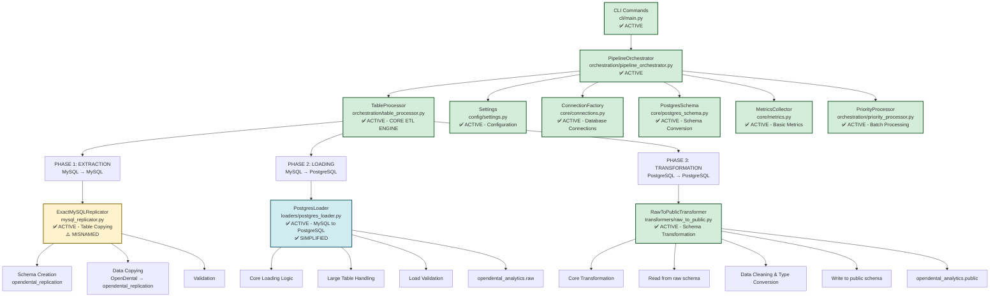

# ETL Pipeline Data Flow Diagram

## Current Data Movement Architecture



## File Status by Data Movement Responsibility

### ✅ ACTIVE DATA MOVEMENT FILES

| File | Purpose | Status | Lines | Complexity |
|------|---------|--------|-------|------------|
| `mysql_replicator.py` | MySQL table copying | ✅ ACTIVE | 510 | Medium |
| `loaders/postgres_loader.py` | MySQL → PostgreSQL loading | ✅ ACTIVE | ~300 | ✅ LOW |
| `transformers/raw_to_public.py` | Raw → Public transformation | ✅ ACTIVE | 643 | Medium |
| `orchestration/table_processor.py` | ETL coordination | ✅ ACTIVE | 421 | ⚠️ HIGH |
| `orchestration/pipeline_orchestrator.py` | Main orchestration | ✅ ACTIVE | 264 | Medium |

### ⚠️ REMAINING COMPLEXITY ISSUES

| File | Purpose | Status | Action |
|------|---------|--------|--------|
| `orchestration/table_processor.py` | Table processing | ⚠️ COMPLEX | **SIMPLIFY** |
| `transformers/base_transformer.py` | Base transformer interface | ⚠️ OVER-ENGINEERED | **SIMPLIFY** |

## Data Flow by Phase

### Phase 1: Extraction (MySQL → MySQL)
```
OpenDental (Source) → ExactMySQLReplicator → opendental_replication (Target)
```

**Files Involved:**
- `mysql_replicator.py` - **ACTIVE** (rename to `mysql_table_copier.py`)
- `orchestration/table_processor.py` - **ACTIVE** (calls replicator)

**Data Movement Methods:**
- `create_exact_replica()` - Schema creation
- `copy_table_data()` - Data copying with chunking
- `verify_exact_replica()` - Validation

### Phase 2: Loading (MySQL → PostgreSQL)
```
opendental_replication → PostgresLoader → opendental_analytics.raw
```

**Files Involved:**
- `loaders/postgres_loader.py` - **ACTIVE** ✅ **SIMPLIFIED**
- `core/postgres_schema.py` - **ACTIVE** (schema conversion)
- `orchestration/table_processor.py` - **ACTIVE** (calls loader)

**Data Movement Methods:**
- `load_table()` - Core loading logic
- `load_table_chunked()` - Large table handling
- `verify_load()` - Load validation

### Phase 3: Transformation (PostgreSQL → PostgreSQL)
```
opendental_analytics.raw → RawToPublicTransformer → opendental_analytics.public
```

**Files Involved:**
- `transformers/raw_to_public.py` - **ACTIVE**
- `orchestration/table_processor.py` - **ACTIVE** (calls transformer)

**Data Movement Methods:**
- `transform_table()` - Core transformation
- `_read_from_raw()` - Read from raw schema
- `_apply_transformations()` - Data cleaning
- `_write_to_public()` - Write to public schema

## Configuration and Support Files

### ✅ ACTIVE SUPPORT FILES

| File | Purpose | Status |
|------|---------|--------|
| `config/settings.py` | Modern configuration | ✅ ACTIVE |
| `core/connections.py` | Database connections | ✅ ACTIVE |
| `core/postgres_schema.py` | Schema conversion | ✅ ACTIVE |
| `core/metrics.py` | Basic metrics | ✅ ACTIVE |
| `orchestration/priority_processor.py` | Batch processing | ✅ ACTIVE |

## PostgresLoader Simplification Summary

### ✅ COMPLETED SIMPLIFICATION

The PostgresLoader has been successfully simplified from **901 lines to ~300 lines** by removing:

#### **Removed Components:**
- **Schema Analysis Methods**: `get_table_schema()`, `has_schema_changed()` (duplicate PostgresSchema functionality)
- **Metadata Methods**: `get_table_grants()`, `get_table_triggers()`, `get_table_views()`, `get_table_dependencies()`
- **Redundant Table Info**: `get_table_row_count()`, `get_table_size()`, `get_table_indexes()`, `get_table_constraints()`, `get_table_foreign_keys()`, `get_table_columns()`, `get_table_primary_key()`, `get_table_partitions()`
- **Utility Methods**: `get_incremental_column()`, `get_last_loaded()`, `update_load_status()`, `_update_load_status_internal()`
- **Unused Imports**: `pandas`, `hashlib`

#### **Kept Core Functionality:**
- `load_table()` - Standard table loading with incremental support
- `load_table_chunked()` - Chunked loading for large tables  
- `verify_load()` - Basic load verification
- `_ensure_postgres_table()` - Schema integration with PostgresSchema
- `_build_load_query()` - Query building for incremental/full loads
- `_build_count_query()` - Count query for chunked loading
- `_get_last_load()` - Last load timestamp retrieval
- `_convert_row_data_types()` - Data type conversion

#### **Benefits:**
- **Reduced Complexity**: From 901 lines to ~300 lines (67% reduction)
- **Focused Purpose**: Only core loading operations
- **Better Maintainability**: Easier to understand and test
- **No Functionality Loss**: All actual ETL operations preserved
- **Cleaner Dependencies**: Removed redundant schema analysis

## Refactoring Priority by Data Movement Impact

### High Priority (Core Data Movement)
1. **Simplify `orchestration/table_processor.py`** - Complex with multiple layers
2. **Rename `mysql_replicator.py`** - Misleading name

### Medium Priority (Support Components)
3. **Simplify base classes** - Reduce over-engineering
4. **Consolidate entry points** - Remove confusion

### Low Priority (Documentation)
5. **Update documentation** - Reflect simplified architecture
6. **Add comprehensive testing** - Ensure reliability

## Data Movement Validation Checklist

### Phase 1: Extraction
- [ ] `mysql_replicator.py` creates exact table replicas
- [ ] Schema validation works correctly
- [ ] Data copying handles large tables
- [ ] Error recovery works properly

### Phase 2: Loading
- [ ] `postgres_loader.py` loads data correctly ✅ **SIMPLIFIED**
- [ ] Schema conversion works properly
- [ ] Chunked loading handles large tables
- [ ] Load verification is accurate

### Phase 3: Transformation
- [ ] `raw_to_public.py` transforms data correctly
- [ ] Data cleaning works properly
- [ ] Type conversions are accurate
- [ ] Transformation tracking works

### Overall Pipeline
- [ ] `table_processor.py` coordinates all phases
- [ ] `pipeline_orchestrator.py` manages overall flow
- [ ] Error handling works across all phases
- [ ] Metrics collection is accurate 